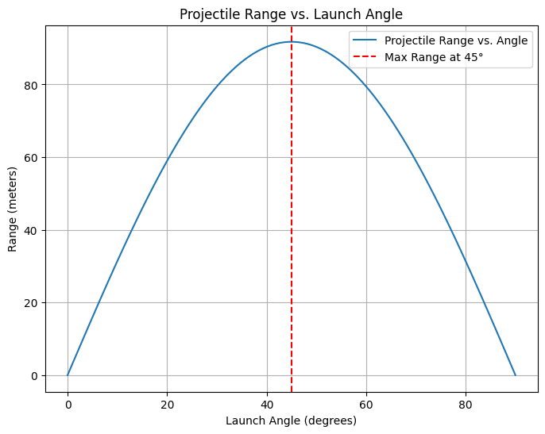

# Problem 1

# Investigating the Range as a Function of the Angle of Projection

## Motivation

Projectile motion, while seemingly simple, provides a rich framework for exploring fundamental principles of physics. The goal is to analyze how the range of a projectile depends on its angle of projection. Despite its simplicity, this problem offers deep insights due to its reliance on both linear and quadratic relationships. The numerous parameters involved—such as initial velocity, gravitational acceleration, and launch height—allow for a broad range of applications, from sports to aerospace engineering.

## Theoretical Foundation

To understand projectile motion, we derive the governing equations from Newton's second law.

## Equations of Motion

The motion of a projectile in a vacuum (neglecting air resistance) is governed by:


$$
x(t) = v_0 \cos(\theta) t
$$

$$
y(t) = v_0 \sin(\theta) t - \frac{1}{2} g t^2
$$


where:

- v<sub>0</sub> is the initial velocity,
- \(\theta\) is the launch angle,
- \(g\) is the acceleration due to gravity,
- \(t\) is the time.

The range \(R\) (horizontal distance) is obtained by solving for \(t\) when \(y = 0\):

\(R = \frac{v_0^2 \sin(2\theta)}{g}\)

## Family of Solutions

- Different initial velocities (( v_0 )) yield higher or lower trajectories.
- Varying launch angles (( \theta )) create different parabolic paths—steeper angles mean greater height but shorter horizontal reach.
- Gravity ( g ) affects descent—on planets like Mars (( g = 3.7 ) m/s²), the projectile would have a longer range than on Earth.


Graphical Representations of Range vs. Angle
The range equation (neglecting air resistance) is:
[ R = \frac{v_0^2 \sin 2\theta}{g} ]


Python Code to Plot Range vs. Angle

```python
import numpy as np
import matplotlib.pyplot as plt

# Parameters
v0 = 30  # Initial velocity in m/s
g = 9.81  # Gravitational acceleration in m/s²
theta = np.linspace(0, 90, 100)  # Angle from 0° to 90°

# Compute range for each angle
R = (v0**2 * np.sin(np.radians(2 * theta))) / g

# Plot
plt.figure(figsize=(8,6))
plt.plot(theta, R, label="Projectile Range vs. Angle")
plt.axvline(x=45, color='r', linestyle='--', label="Max Range at 45°")
plt.xlabel("Launch Angle (degrees)")
plt.ylabel("Range (meters)")
plt.title("Projectile Range vs. Launch Angle")
plt.legend()
plt.grid()
plt.show()
```



📌 This graph will:
- Show range peaking at 45° (ideal case).
- Demonstrate how increasing ( v_0 ) scales up range.
- Shift if gravity ( g ) is altered (e.g., Moon vs. Earth).


imitations & Realistic Adjustments
✅ Key Assumptions in the Ideal Model:
- No air resistance—real projectiles experience drag, which shortens range.
- Launch and landing at same height—uneven terrains require modifications.
- Neglecting wind effects—real-world projectiles are influenced by crosswinds.
🚀 More Realistic Factors:
- Air Resistance (Drag Force ( F_d ))
- Introduce ( F_d = C_d v^2 ), where ( C_d ) is the drag coefficient.
- Would shift peak angle below 45° due to extra deceleration.
- Wind Influence
- Headwinds shorten range; tailwinds extend it.
- Requires vector velocity adjustments.
- Variable Launch Heights
- If launching from an elevated position, the range equation must include height terms.
- Results in longer descent phases.
