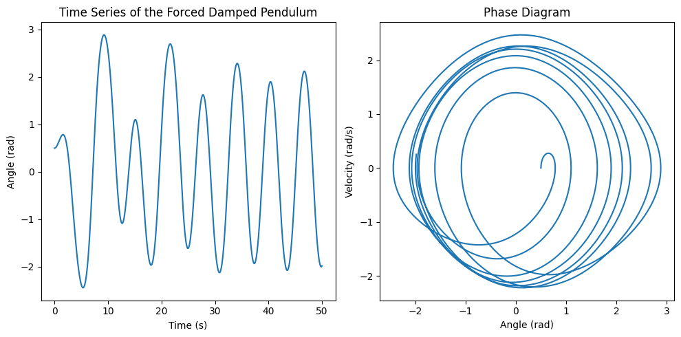

# Problem 2

# Investigating the Dynamics of a Forced Damped Pendulum

## Motivation

The forced damped pendulum is a captivating example of a physical system with intricate behavior resulting from the interplay of damping, restoring forces, and external driving forces. By introducing both damping and external periodic forcing, the system demonstrates a transition from simple harmonic motion to a rich spectrum of dynamics, including resonance, chaos, and quasiperiodic behavior. These phenomena serve as a foundation for understanding complex real-world systems, such as driven oscillators, climate systems, and mechanical structures under periodic stress.

Adding forcing introduces new parameters, such as the amplitude and frequency of the external force, which significantly affect the pendulum's behavior. By systematically varying these parameters, a diverse class of solutions can be observed, including synchronized oscillations, chaotic motion, and resonance phenomena. These behaviors not only highlight fundamental physics principles but also provide insights into engineering applications such as energy harvesting, vibration isolation, and mechanical resonance.

## Theoretical Foundation

The motion of a forced damped pendulum is described by the following second-order differential equation:

\[
\frac{d^2\theta}{dt^2} + \gamma \frac{d\theta}{dt} + \omega_0^2 \sin(\theta) = A \cos(\Omega t)
\]

Where:  

- \(\theta(t)\) is the angular displacement of the pendulum,  

- \(\gamma\) is the damping coefficient,  

- \(\omega_0\) is the natural frequency of the undamped pendulum,  

- \(A\) is the driving amplitude,  

- \(\Omega\) is the driving frequency.

## Small-Angle Approximation (Linearization)

For small oscillations, we can make the small-angle approximation, where \(\sin(\theta) \approx \theta\) (assuming \(\theta\) is in radians and small):

\[
\frac{d^2\theta}{dt^2} + \gamma \frac{d\theta}{dt} + \omega_0^2 \theta = A \cos(\Omega t)
\]

This is a linear second-order ordinary differential equation for a driven damped harmonic oscillator. The solution of this equation depends on the relative values of the damping coefficient, the driving frequency, and the natural frequency of the pendulum.

## Resonance Conditions

Resonance occurs when the driving frequency \(\Omega\) matches the natural frequency \(\omega_0\) of the pendulum. Under these conditions, even small driving forces can lead to large oscillations because the system efficiently absorbs energy from the external force.

To explore resonance more concretely, we can examine the solution to the differential equation in the form of:

\[
\theta(t) = \theta_0 e^{-\gamma t} \cos(\omega t - \delta)
\]

Where \(\omega\) is the effective frequency of the system, and \(\delta\) is a phase shift. The amplitude \(A\) of the oscillations will depend on the driving force, the damping coefficient, and the detuning between the driving frequency and the natural frequency of the system. The resonance condition is when \(\Omega \approx \omega_0\), and the amplitude increases dramatically when \(\Omega\) is close to \(\omega_0\).

In summary, resonance causes the system to oscillate with large amplitude at the driving frequency, and it leads to high energy absorption.

---

## Analysis of Dynamics

### Effect of the Damping Coefficient (\(\gamma\))

The damping coefficient determines how quickly the energy in the system is dissipated. In the forced damped pendulum, damping:  

- **Low damping**: Allows for large amplitude oscillations and may contribute to a sharp resonance peak.  

- **High damping**: Reduces the amplitude of oscillations, and if sufficiently high, the system may not oscillate at all. This may suppress chaotic behavior and lead to a smooth, decaying response.  

- **Critical damping**: Occurs when \(\gamma = 2\sqrt{mK}\), where the pendulum returns to equilibrium as quickly as possible without oscillating. 

### Effect of the Driving Amplitude (\(A\))

The driving amplitude influences how much energy is being transferred to the pendulum. As \(A\) increases:  

- At low \(A\), the system may undergo regular oscillations.  

- As \(A\) increases, periodic motion may switch to quasiperiodic or even chaotic motion. This transition happens due to nonlinear interactions between the driving force and the pendulum's motion.

### Effect of the Driving Frequency (\(\Omega\))

The driving frequency affects how the system absorbs energy from the driving force. When \(\Omega\) is near \(\omega_0\), resonance occurs and the system can absorb large amounts of energy, leading to large amplitude oscillations. If \(\Omega\) is far from \(\omega_0\), the system is less likely to enter resonance, and the oscillations are typically smaller.

### Regular vs. Chaotic Motion

As we vary \(A\), \(\gamma\), and \(\Omega\), the pendulum's motion can transition from periodic to chaotic:  

- **Periodic motion**: The pendulum oscillates in a stable, repeating manner.  

- **Quasiperiodic motion**: The system oscillates in a non-repeating but predictable manner.  

- **Chaotic motion**: Small changes in initial conditions lead to unpredictable motion, and the system exhibits sensitive dependence on initial conditions. Chaos can emerge if the system is driven at certain amplitudes and frequencies, especially when nonlinearity and resonance effects combine.

---

## Practical Applications

The forced damped pendulum model has various practical applications across multiple domains, particularly in systems subjected to periodic forces.

#### Energy Harvesting Devices
- The forced damped pendulum model can be used to design energy harvesting devices, where oscillations induced by external forces (such as vibrations from machinery or ambient energy) are converted into electrical energy. By tuning the system to resonate at the frequency of the external force, large amounts of energy can be harvested.

#### Suspension Bridges
- Suspension bridges, especially those with long spans, are susceptible to oscillations caused by wind or other external periodic forces. The dynamics of the bridge under these forces can be modeled by a forced damped pendulum, where the damping (structural damping) and driving forces (wind or traffic-induced forces) must be carefully balanced to avoid resonance, which could lead to catastrophic failure.

#### Oscillating Circuits
- In electrical engineering, forced damped oscillators are used to model circuits with resistors, capacitors, and inductors driven by an external alternating current (AC). The resonance condition plays a critical role in the design of tuned circuits for radios, televisions, and other wireless communication technologies.

---

### Implementation

To simulate the motion of a forced damped pendulum computationally, we can solve the equation numerically for various values of the damping coefficient, driving force, and initial conditions. Here’s a general outline of the steps to simulate the system:

1. **Numerical Solution of the Differential Equation**: Use a method like the Euler method or Runge-Kutta method to solve the second-order differential equation numerically.
  
2. **Phase Diagrams and Poincaré Sections**: These can be used to visualize the dynamics. In a phase diagram, the state of the system is plotted in terms of position vs. velocity, showing how the system evolves over time. Poincaré sections can capture the transitions between periodic, quasiperiodic, and chaotic regimes by plotting intersections of the system's trajectory with a plane of constant time.

3. **Visualization**: We can plot time series, phase space trajectories, and bifurcation diagrams to analyze how the system behaves under different conditions.

#### Computational Model Example

Here's a basic framework for simulating the system:

```python
import numpy as np
import matplotlib.pyplot as plt
from scipy.integrate import solve_ivp

# Constants
gamma = 0.2  # damping coefficient
omega_0 = 1.0  # natural frequency
A = 1.0  # driving amplitude
Omega = 1.0  # driving frequency

# Define the differential equation
def forced_pendulum(t, y):
    theta, theta_dot = y
    dtheta_dt = theta_dot
    dtheta_dot_dt = -gamma * theta_dot - omega_0**2 * np.sin(theta) + A * np.cos(Omega * t)
    return [dtheta_dt, dtheta_dot_dt]

# Initial conditions
y0 = [0.5, 0]  # Initial angle and velocity

# Time span
t_span = (0, 50)
t_eval = np.linspace(0, 50, 1000)

# Solve the differential equation
solution = solve_ivp(forced_pendulum, t_span, y0, t_eval=t_eval)

# Plotting the time series and phase diagram
plt.figure(figsize=(10, 5))

# Time series plot
plt.subplot(1, 2, 1)
plt.plot(solution.t, solution.y[0])
plt.xlabel('Time (s)')
plt.ylabel('Angle (rad)')
plt.title('Time Series of the Forced Damped Pendulum')

# Phase diagram plot
plt.subplot(1, 2, 2)
plt.plot(solution.y[0], solution.y[1])
plt.xlabel('Angle (rad)')
plt.ylabel('Velocity (rad/s)')
plt.title('Phase Diagram')

plt.tight_layout()
plt.show()
```



In the above simulation:<br>
- We use `solve_ivp` to numerically solve the second-order differential equation.<br>
- The results are visualized both in time series and phase space.
  
To observe transitions to chaos, varying parameters like \(A\), \(\gamma\), and \(\Omega\) will result in different types of motion, which can be analyzed through phase space diagrams and Poincaré sections.

---

### Conclusion

The forced damped pendulum is a rich system that demonstrates complex dynamics such as resonance, chaos, and quasiperiodic behavior, depending on the damping coefficient, driving amplitude, and frequency. These phenomena have broad applications in real-world systems like energy harvesting, structural engineering, and electronics. Through computational modeling, we can better understand how changes in system parameters influence behavior and predict transitions between regular and chaotic motion.


