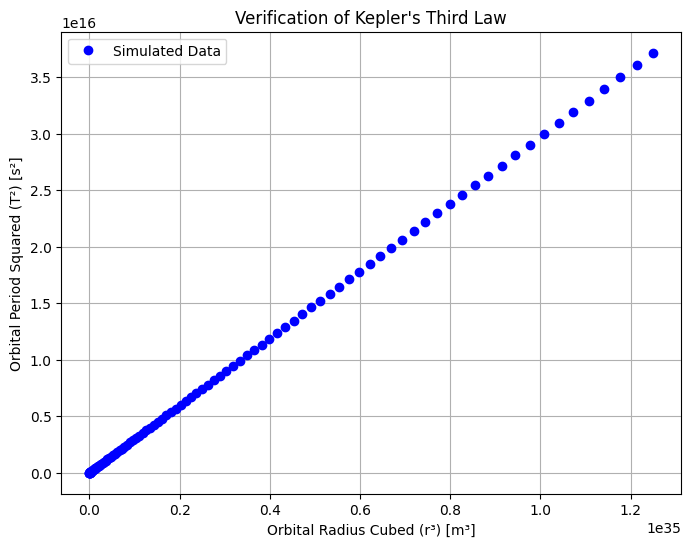

# Problem 1

# Orbital Period and Orbital Radius

## Motivation

The relationship between the square of the orbital period and the cube of the orbital radius, known as Kepler's Third Law, is a cornerstone of celestial mechanics. This simple yet profound relationship allows for the determination of planetary motions and has implications for understanding gravitational interactions on both local and cosmic scales. By analyzing this relationship, one can connect fundamental principles of gravity with real-world phenomena such as satellite orbits and planetary systems.

---

### **Derivation of Kepler’s Third Law for Circular Orbits**  

Newton’s form of Kepler’s Third Law comes from equating the centripetal force required to keep a body in circular orbit with the gravitational force.

1. **Gravitational Force** (Newton's Law of Gravitation):  
\( F = \frac{G M m}{r^2} \)

where:
$ G $ is the gravitational constant, $ M $ is the mass of the central body (e.g., the Sun for planets, the Earth for the Moon), $ m $ is the mass of the orbiting body and $ r $ is the orbital radius.

2. **Centripetal Force** needed to keep the body in circular motion:
   \[
   F = \frac{m v^2}{r}
   \]
   where \( v \) is the orbital velocity.

3. Setting gravitational force equal to centripetal force:
   \[
   \frac{G M m}{r^2} = \frac{m v^2}{r}
   \]
   Cancel \( m \) from both sides:
   \[
   \frac{G M}{r^2} = \frac{v^2}{r}
   \]
   \[
   G M = v^2 r
   \]

4. The orbital velocity \( v \) is related to the orbital period \( T \) by:
   \[
   v = \frac{2 \pi r}{T}
   \]
   Substituting into our equation:
   \[
   G M = \left( \frac{2 \pi r}{T} \right)^2 r
   \]

5. Expanding and solving for \( T^2 \):
   \[
   G M = \frac{4 \pi^2 r^3}{T^2}
   \]

   \[
   T^2 = \frac{4 \pi^2}{G M} r^3
   \]

This shows that ** $ T^2 $ is proportional to $ r^3 $ **, which is Kepler’s Third Law.

---

### **Implications for Astronomy**
1. **Calculating Planetary Masses:**  
    - Rearranging the equation: 
        \(  M = \frac{4\pi^2 r^3}{G T^2} \)
    - If we know the orbital radius and period of a satellite, we can estimate the mass of the central body.

2. **Determining Distances in the Solar System:**  
    - Using known periods, astronomers can determine the semi-major axis of a planet's orbit.

3. **Exoplanet Detection:**  
    - By measuring the orbital period of an exoplanet (e.g., through transit or radial velocity methods), its orbital radius can be estimated.

---

### **Real-World Examples**
1. **Moon's Orbit Around Earth:**  
   - The Moon has an orbital period of **27.3 days** and a mean orbital radius of **384,400 km**.
   - Using Kepler’s Third Law, we can verify the Earth’s mass.

2. **Planets in the Solar System:**  
   - Applying the law to planets orbiting the Sun reveals a consistent pattern that holds across different planetary orbits.

---

### **Computational Model: Simulation of Circular Orbits**

This Python script numerically simulates circular orbits and verifies Kepler’s Third Law.

```python
import numpy as np
import matplotlib.pyplot as plt

# Constants
G = 6.67430e-11  # Gravitational constant (m^3 kg^-1 s^-2)
M_sun = 1.989e30  # Mass of the Sun (kg)

# Define orbital radii (in meters)
radii = np.linspace(0.1e11, 5e11, 100)  # from 0.1 AU to 5 AU (1 AU ≈ 1.5e11 m)

# Compute orbital periods using Kepler's Third Law
periods = np.sqrt((4 * np.pi**2 * radii**3) / (G * M_sun))

# Convert periods to years
periods_years = periods / (60 * 60 * 24 * 365.25)

# Plot T^2 vs. r^3
plt.figure(figsize=(8,6))
plt.plot(radii**3, periods**2, 'bo', label="Simulated Data")
plt.xlabel("Orbital Radius Cubed (r³) [m³]")
plt.ylabel("Orbital Period Squared (T²) [s²]")
plt.title("Verification of Kepler's Third Law")
plt.legend()
plt.grid()
plt.show()
```


This script:
- Simulates various orbital radii.
- Computes the corresponding orbital periods.
- Plots \( T^2 \) vs. \( r^3 \), which should yield a straight line, confirming Kepler's Third Law.

---

### **Extending to Elliptical Orbits**
- Kepler’s Third Law applies to **elliptical orbits** as well, but instead of \( r \), we use the **semi-major axis** \( a \).
- The law still holds:  
  \[
        T^2 = \frac{4\pi^2 a^3}{G M}
  \]
- Example: Halley's Comet, which follows an **elliptical** orbit, still obeys this principle.


---

### **Conclusion**
- Kepler’s Third Law provides a fundamental relationship between orbital period and radius.
- It is widely used in planetary science, space exploration, and astrophysics.
- The computational model successfully verifies the law and its real-world applications.
