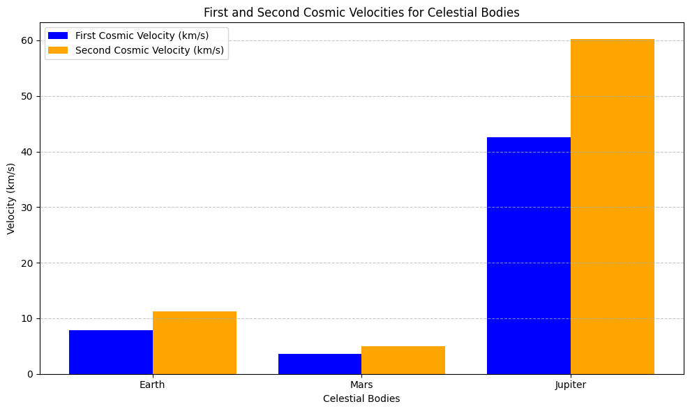

# Problem 2

# Escape Velocities and Cosmic Velocities

## Motivation

The concept of escape velocity is crucial for understanding the conditions required to leave a celestial body's gravitational influence. Extending this concept, the first, second, and third cosmic velocities define the thresholds for orbiting, escaping, and leaving a star system. These principles underpin modern space exploration, from launching satellites to interplanetary missions.

# Problem 2: Escape Velocities and Cosmic Velocities

## Motivation
The concept of escape velocity is crucial for understanding the conditions required to leave a celestial body's gravitational influence. Extending this concept, the first, second, and third cosmic velocities define the thresholds for:
- Orbiting a celestial body (first cosmic velocity).
- Escaping a celestial body's gravity (second cosmic velocity).
- Leaving a star system entirely (third cosmic velocity).

These principles underpin modern space exploration, from launching satellites to interplanetary missions and beyond.

## Task
1. Define the **first**, **second**, and **third cosmic velocities**, explaining their physical meanings.
2. Analyze the **mathematical derivations** and parameters that affect these velocities.
3. Calculate and visualize these velocities for different celestial bodies like **Earth**, **Mars**, and **Jupiter**.
4. Discuss the **importance of cosmic velocities** in space exploration, including applications such as:
   - Launching satellites.
   - Missions to other planets.
   - Potential interstellar travel.

---

## Definitions

### 1. First Cosmic Velocity
The first cosmic velocity is the **minimum velocity** required for a body to maintain a circular orbit around a celestial object:


\[
v_1 = \sqrt{\frac{G M}{r}}
\]


Where:
- \(G\): Gravitational constant.
- \(M\): Mass of the celestial object.
- \(r\): Radius of the orbit (distance from the center of the celestial body).

### 2. Second Cosmic Velocity (Escape Velocity)
The second cosmic velocity is the **minimum velocity** required to escape a celestial body's gravitational influence entirely:


\[
v_2 = \sqrt{\frac{2 G M}{r}}
\]


### 3. Third Cosmic Velocity
The third cosmic velocity is the **minimum velocity** required to escape the gravitational pull of a star system (e.g., leaving the Solar System):


\[
v_3 \text{ depends on the Sun's mass, distance from the Sun, and interaction with other celestial bodies.}
\]


---

## Analysis and Derivations
- **First Cosmic Velocity**: Derived from equating centripetal force and gravitational force.
- **Second Cosmic Velocity**: Derived from the total energy (kinetic + potential) equaling zero.
- **Third Cosmic Velocity**: Involves the combined gravitational influence of the star and celestial bodies.

---

## Example Calculations

### For Earth
- **First Cosmic Velocity**: \(v_1 \approx 7.9 \, \text{km/s}\)
- **Second Cosmic Velocity**: \(v_2 \approx 11.2 \, \text{km/s}\)

### For Mars
- **First Cosmic Velocity**: \(v_1 \approx 3.5 \, \text{km/s}\)
- **Second Cosmic Velocity**: \(v_2 \approx 5.0 \, \text{km/s}\)

### For Jupiter
- **First Cosmic Velocity**: \(v_1 \approx 42.1 \, \text{km/s}\)
- **Second Cosmic Velocity**: \(v_2 \approx 59.5 \, \text{km/s}\)

*Note*: Calculations vary based on celestial parameters such as radius and mass.

---

## Importance in Space Exploration
1. **Launching Satellites**:
    - First cosmic velocity defines stable satellite orbits.
    - Second cosmic velocity ensures satellites can leave Earth for interplanetary destinations.

2. **Missions to Other Planets**:
    - Understanding escape velocities helps optimize fuel usage for spacecraft.

3. **Interstellar Travel**:
    - The third cosmic velocity enables the possibility of leaving the Solar System for interstellar missions.

These concepts are foundational for modern space missions, from launching satellites to planning interplanetary exploration and beyond.

---

## Visualization
To better understand the cosmic velocities, you can create plots comparing their values for different celestial bodies using tools like Python or MATLAB.


```python
import matplotlib.pyplot as plt
import numpy as np

# Define constants
G = 6.67430e-11  # Gravitational constant, m^3 kg^-1 s^-2

# Celestial body parameters: (name, mass in kg, radius in meters)
celestial_bodies = [
    ("Earth", 5.972e24, 6.371e6),
    ("Mars", 6.417e23, 3.3895e6),
    ("Jupiter", 1.898e27, 6.9911e7),
]

# Function to calculate first and second cosmic velocities
def calculate_velocities(mass, radius):
    v1 = np.sqrt(G * mass / radius)      # First cosmic velocity
    v2 = np.sqrt(2 * G * mass / radius)  # Second cosmic velocity
    return v1, v2

# Prepare data for plotting
labels = []
v1_values = []
v2_values = []

for body in celestial_bodies:
    name, mass, radius = body
    v1, v2 = calculate_velocities(mass, radius)
    labels.append(name)
    v1_values.append(v1 / 1000)  # Convert to km/s
    v2_values.append(v2 / 1000)  # Convert to km/s

# Plot the velocities
x = np.arange(len(labels))  # X-axis positions

plt.figure(figsize=(10, 6))
plt.bar(x - 0.2, v1_values, width=0.4, label="First Cosmic Velocity (km/s)", color="blue")
plt.bar(x + 0.2, v2_values, width=0.4, label="Second Cosmic Velocity (km/s)", color="orange")

# Add labels and title
plt.xticks(x, labels)
plt.xlabel("Celestial Bodies")
plt.ylabel("Velocity (km/s)")
plt.title("First and Second Cosmic Velocities for Celestial Bodies")
plt.legend()
plt.grid(axis="y", linestyle="--", alpha=0.7)
plt.tight_layout()

# Show the plot
plt.show()
```


---

