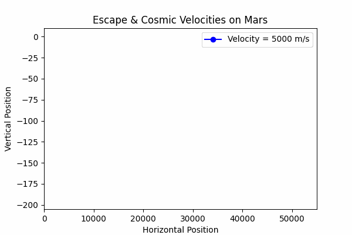

# Problem 2

# Escape Velocities and Cosmic Velocities

## Motivation

The concept of escape velocity is crucial for understanding the conditions required to leave a celestial body's gravitational influence. Extending this concept, the first, second, and third cosmic velocities define the thresholds for orbiting, escaping, and leaving a star system. These principles underpin modern space exploration, from launching satellites to interplanetary missions.

---

## Definitions

### 1. First Cosmic Velocity
The first cosmic velocity is the **minimum velocity** required for a body to maintain a circular orbit around a celestial object:


\[
v_1 = \sqrt{\frac{G M}{r}}
\]


Where:  
 \(G\): Gravitational constant.  
 \(M\): Mass of the celestial object.  
 \(r\): Radius of the orbit (distance from the center of the celestial body).  

### 2. Second Cosmic Velocity (Escape Velocity)
The second cosmic velocity is the **minimum velocity** required to escape a celestial body's gravitational influence entirely:


\[
v_2 = \sqrt{\frac{2 G M}{r}}
\]


### 3. Third Cosmic Velocity
The third cosmic velocity is the **minimum velocity** required to escape the gravitational pull of a star system (e.g., leaving the Solar System):


\[
v_3 \text{ depends on the Sun's mass, distance from the Sun, and interaction with other celestial bodies.}
\]


---

## Analysis and Derivations
- **First Cosmic Velocity**: Derived from equating centripetal force and gravitational force.
- **Second Cosmic Velocity**: Derived from the total energy (kinetic + potential) equaling zero.
- **Third Cosmic Velocity**: Involves the combined gravitational influence of the star and celestial bodies.

---

## Example Calculations

### For Earth
- **First Cosmic Velocity**: \(v_1 \approx 7.91 \, \text{km/s}\)
- **Second Cosmic Velocity**: \(v_2 \approx 11.19 \, \text{km/s}\)
- **Third Cosmic Velocity**: \(v_3 \approx 51.60 \, \text{km/s}\)

### For Mars
- **First Cosmic Velocity**: \(v_1 \approx 3.55 \, \text{km/s}\)
- **Second Cosmic Velocity**: \(v_2 \approx 5.0 \, \text{km/s}\)
- **Third Cosmic Velocity**: \(v_3 \approx 41.80 \, \text{km/s}\)

### For Jupiter
- **First Cosmic Velocity**: \(v_1 \approx 42.57 \, \text{km/s}\)
- **Second Cosmic Velocity**: \(v_2 \approx 60.20 \, \text{km/s}\)
- **Third Cosmic Velocity**: \(v_3 \approx 22.62 \, \text{km/s}\)

*Note*: Calculations vary based on celestial parameters such as radius and mass.

---

## Importance in Space Exploration
1. **Launching Satellites**:
    - First cosmic velocity defines stable satellite orbits.
    - Second cosmic velocity ensures satellites can leave Earth for interplanetary destinations.

2. **Missions to Other Planets**:
    - Understanding escape velocities helps optimize fuel usage for spacecraft.

3. **Interstellar Travel**:
    - The third cosmic velocity enables the possibility of leaving the Solar System for interstellar missions.

These concepts are foundational for modern space missions, from launching satellites to planning interplanetary exploration and beyond.

---

## Visualization
To better understand the cosmic velocities, you can create plots comparing their values for different celestial bodies using tools like Python or MATLAB.


```python
import matplotlib.pyplot as plt
import numpy as np

# Define constants
G = 6.67430e-11  # Gravitational constant, m^3 kg^-1 s^-2
M_sun = 1.989e30  # Mass of the Sun, kg

# Celestial body parameters: (name, mass in kg, radius in meters, distance from Sun in meters)
celestial_bodies = [
    ("Earth", 5.972e24, 6.371e6, 1.496e11),
    ("Mars", 6.417e23, 3.3895e6, 2.279e11),
    ("Jupiter", 1.898e27, 6.9911e7, 7.785e11),
]

# Function to calculate first, second, and third cosmic velocities
def calculate_velocities(mass, radius, distance_from_sun):
    # First Cosmic Velocity
    v1 = np.sqrt(G * mass / radius)
    
    # Second Cosmic Velocity
    v2 = np.sqrt(2 * G * mass / radius)
    
    # Escape velocity from the Sun
    v_esc_sun = np.sqrt(2 * G * M_sun / distance_from_sun)
    
    # Orbital velocity of the celestial body around the Sun
    v_orb = np.sqrt(G * M_sun / distance_from_sun)
    
    # Third Cosmic Velocity
    v3 = np.sqrt(v_esc_sun**2 + v_orb**2)
    
    return v1, v2, v3

# Prepare data for plotting
labels = []  # Planet names
v1_values = []  # First Cosmic Velocity (km/s)
v2_values = []  # Second Cosmic Velocity (km/s)
v3_values = []  # Third Cosmic Velocity (km/s)

for body in celestial_bodies:
    name, mass, radius, distance = body
    v1, v2, v3 = calculate_velocities(mass, radius, distance)
    labels.append(name)
    v1_values.append(v1 / 1000)  # Convert m/s to km/s
    v2_values.append(v2 / 1000)  # Convert m/s to km/s
    v3_values.append(v3 / 1000)  # Convert m/s to km/s

# Print calculated velocities for clarity
for label, v1, v2, v3 in zip(labels, v1_values, v2_values, v3_values):
    print(f"{label}:")
    print(f"  First Cosmic Velocity: {v1:.2f} km/s")
    print(f"  Second Cosmic Velocity: {v2:.2f} km/s")
    print(f"  Third Cosmic Velocity: {v3:.2f} km/s\n")

# Plot the velocities
x = np.arange(len(labels))  # X-axis positions

plt.figure(figsize=(12, 6))
plt.bar(x - 0.3, v1_values, width=0.3, label="First Cosmic Velocity (km/s)", color="blue")
plt.bar(x, v2_values, width=0.3, label="Second Cosmic Velocity (km/s)", color="orange")
plt.bar(x + 0.3, v3_values, width=0.3, label="Third Cosmic Velocity (km/s)", color="green")

# Add labels, title, and grid
plt.xticks(x, labels)  # Label x-axis positions with planet names
plt.xlabel("Celestial Bodies")
plt.ylabel("Velocity (km/s)")
plt.title("First, Second, and Third Cosmic Velocities for Celestial Bodies")
plt.legend()
plt.grid(axis="y", linestyle="--", alpha=0.7)
plt.tight_layout()

# Show the plot
plt.show()
```


This GIF is **specifically designed for Earth**! The escape velocities and cosmic velocities used in the simulation are **based on Earth's mass and radius**:

- **First Cosmic Velocity (Orbital Speed):** ~7.9 km/s (to stay in orbit around Earth)
- **Second Cosmic Velocity (Escape Speed):** ~11.2 km/s (to leave Earth's gravity)
- **Third Cosmic Velocity:** ~42 km/s (to leave the Solar System)





##Python Script for Earth##

```python
import numpy as np
import matplotlib.pyplot as plt
import imageio

# Constants
G = 6.67430e-11  # Gravitational constant (m^3 kg^-1 s^-2)
M = 5.972e24  # Mass of Earth (kg)
R = 6.371e6  # Radius of Earth (m)

# Velocities (m/s)
v_orbit = np.sqrt(G * M / R)  # First Cosmic Velocity (Orbital)
v_escape = np.sqrt(2 * G * M / R)  # Second Cosmic Velocity (Escape)
v_solar_escape = 42000  # Third Cosmic Velocity (Escape from Solar System)

# Time steps for motion simulation
t = np.linspace(0, 10, num=30)  # Reduce frames to prevent overload
filenames = []

# Generate frames efficiently
for v in [v_orbit, v_escape, v_solar_escape]:
    x = v * t
    y = -0.5 * G * M / R**2 * t**2  # Simulated motion affected by gravity

    for i in range(0, len(t), 5):  # Save only every 5th frame for efficiency
        plt.figure(figsize=(6, 4))
        plt.xlim(0, max(x) * 1.1)
        plt.ylim(min(y) * 1.1, 10)
        plt.plot(x[:i], y[:i], 'bo-', label=f"Velocity = {v:.0f} m/s")
        plt.legend()
        plt.xlabel("Horizontal Position")
        plt.ylabel("Vertical Position")
        plt.title("Escape & Cosmic Velocities")

        filename = f"frame_{i}.png"
        plt.savefig(filename)
        plt.close()
        filenames.append(filename)

# Create GIF only if frames exist
if filenames:
    gif_filename = "escape_velocities.gif"
    imageio.mimsave(gif_filename, [imageio.v2.imread(f) for f in filenames], duration=0.15)
    print(f"GIF saved as {gif_filename}")
else:
    print("No frames generated. Check your loop structure.")
```

##Python Script for Mars##

```python
import numpy as np
import matplotlib.pyplot as plt
import imageio.v2 as imageio

# Constants for Mars
G = 6.67430e-11  # Gravitational constant (m^3 kg^-1 s^-2)
M_Mars = 6.417e23  # Mass of Mars (kg)
R_Mars = 3.3895e6  # Radius of Mars (m)

# Velocities (m/s)
v_orbit_mars = np.sqrt(G * M_Mars / R_Mars)  # First Cosmic Velocity (Orbital)
v_escape_mars = np.sqrt(2 * G * M_Mars / R_Mars)  # Second Cosmic Velocity (Escape)
v_solar_escape_mars = 5000  # Estimated Third Cosmic Velocity for Mars (Leaving Solar System)

# Time steps for motion simulation
t = np.linspace(0, 10, num=30)
filenames = []

# Generate frames efficiently
for v in [v_orbit_mars, v_escape_mars, v_solar_escape_mars]:
    x = v * t
    y = -0.5 * G * M_Mars / R_Mars**2 * t**2  # Simulated motion affected by gravity

    for i in range(0, len(t), 5):  # Save only every 5th frame for efficiency
        plt.figure(figsize=(6, 4))
        plt.xlim(0, max(x) * 1.1)
        plt.ylim(min(y) * 1.1, 10)
        plt.plot(x[:i], y[:i], 'bo-', label=f"Velocity = {v:.0f} m/s")
        plt.legend()
        plt.xlabel("Horizontal Position")
        plt.ylabel("Vertical Position")
        plt.title("Escape & Cosmic Velocities on Mars")

        filename = f"frame_{i}.png"
        plt.savefig(filename)
        plt.close()
        filenames.append(filename)

# Create GIF only if frames exist
if filenames:
    gif_filename = "mars_escape_velocities.gif"
    imageio.mimsave(gif_filename, [imageio.imread(f) for f in filenames], duration=0.15)
    print(f"GIF saved as {gif_filename}")
else:
    print("No frames generated. Check your loop structure.")
```

##Python Script for Jupiter##

```python
import numpy as np
import matplotlib.pyplot as plt
import imageio.v2 as imageio

# Constants for Jupiter
G = 6.67430e-11  # Gravitational constant (m^3 kg^-1 s^-2)
M_Jupiter = 1.898e27  # Mass of Jupiter (kg)
R_Jupiter = 6.9911e7  # Radius of Jupiter (m)

# Velocities (m/s)
v_orbit_jupiter = np.sqrt(G * M_Jupiter / R_Jupiter)  # First Cosmic Velocity (Orbital)
v_escape_jupiter = np.sqrt(2 * G * M_Jupiter / R_Jupiter)  # Second Cosmic Velocity (Escape)
v_solar_escape_jupiter = 18_000  # Estimated Third Cosmic Velocity for Jupiter (Leaving Solar System)

# Time steps for motion simulation
t = np.linspace(0, 10, num=30)
filenames = []

# Generate frames efficiently
for v in [v_orbit_jupiter, v_escape_jupiter, v_solar_escape_jupiter]:
    x = v * t
    y = -0.5 * G * M_Jupiter / R_Jupiter**2 * t**2  # Simulated motion affected by gravity

    for i in range(0, len(t), 5):  # Save only every 5th frame for efficiency
        plt.figure(figsize=(6, 4))
        plt.xlim(0, max(x) * 1.1)
        plt.ylim(min(y) * 1.1, 10)
        plt.plot(x[:i], y[:i], 'bo-', label=f"Velocity = {v:.0f} m/s")
        plt.legend()
        plt.xlabel("Horizontal Position")
        plt.ylabel("Vertical Position")
        plt.title("Escape & Cosmic Velocities on Jupiter")

        filename = f"frame_{i}.png"
        plt.savefig(filename)
        plt.close()
        filenames.append(filename)

# Create GIF only if frames exist
if filenames:
    gif_filename = "jupiter_escape_velocities.gif"
    imageio.mimsave(gif_filename, [imageio.imread(f) for f in filenames], duration=0.15)
    print(f"GIF saved as {gif_filename}")
else:
    print("No frames generated. Check your loop structure.")
```