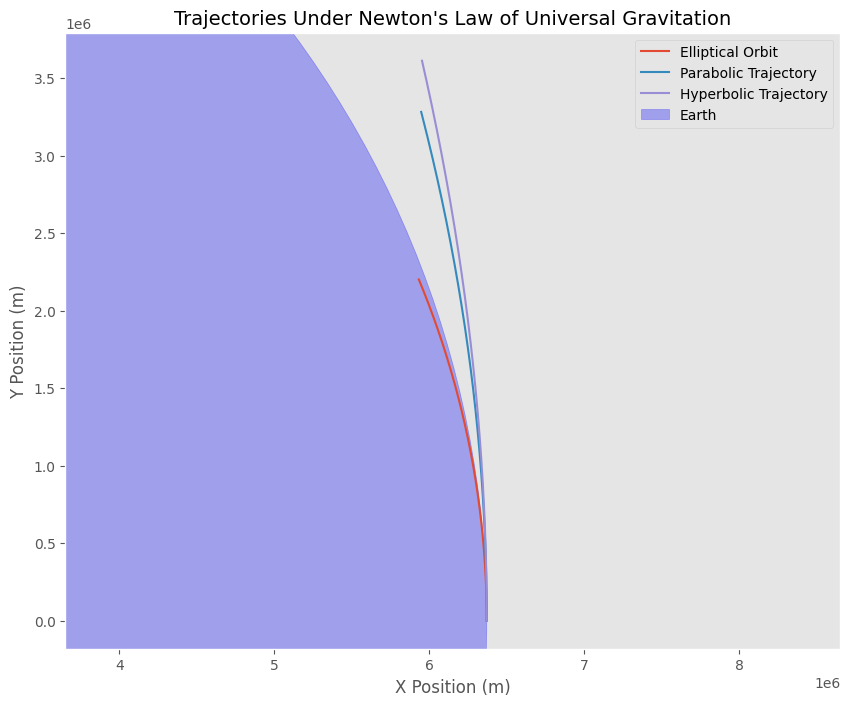

# Problem 3

# Trajectories of a Freely Released Payload Near Earth

## Motivation

When a payload is released from a moving rocket near Earth, its trajectory depends on its initial conditions (position, velocity, and altitude) as well as Earth's gravitational pull. Depending on the initial speed and direction, the payload can follow one of several possible paths:  
- **Elliptical Orbit:** When the payload's speed is less than the circular orbital speed, it will remain bound to Earth on an elliptical orbit.  
- **Parabolic Trajectory:** When the payload's speed is exactly the escape velocity, it follows a parabolic path, representing the threshold between bound and unbound orbits.  
- **Hyperbolic Trajectory:** If the payload's speed exceeds the escape velocity, it follows a hyperbolic path and escapes Earth’s gravitational pull.  

Understanding these trajectories is crucial for:  
- **Orbital Insertion:** Placing satellites and payloads into stable orbits.  
- **Reentry:** Safely returning objects to Earth.  
- **Escape Scenarios:** Planning missions that leave Earth’s gravitational field for interplanetary or even interstellar travel.


## Theoretical Background

When an object moves under the influence of Earth's gravity, its acceleration is given by Newton's law of universal gravitation:


\[
\vec{a} = -\frac{\mu}{r^3}\vec{r} \quad \text{with} \quad \mu = G M_{\text{earth}}
\]


Where:  
 \( G \) is the gravitational constant.  
 \( M_{\text{earth}} \) is Earth's mass.  
 \( r \) is the distance from Earth's center.  

If the payload is released at an altitude \( h \) above Earth's surface, the initial distance is:


\[
r_0 = R_{\text{earth}} + h
\]


Depending on the payload's speed \( v_0 \):  
- For **elliptical orbits**:  
\( v_0 < v_{\text{circular}} \)  
where \( v_{\text{circular}} = \sqrt{\mu / r_0} \)  

- For a **parabolic trajectory**:  
\( v_0 = v_{\text{escape}} = \sqrt{2\mu / r_0} \)  

- For **hyperbolic trajectories**:  
\( v_0 > v_{\text{escape}} \)

## Numerical Simulation and Visualization

The following Python script uses a numerical integrator to solve the two-dimensional equations of motion for a payload released near Earth. It simulates three cases:  
- **Elliptical Orbit:** \( v_0 = 0.95 \times v_{\text{circular}} \)  
- **Parabolic Trajectory:** \( v_0 = v_{\text{escape}} \)  
- **Hyperbolic Trajectory:** \( v_0 = 1.1 \times v_{\text{escape}} \)  

```python
import numpy as np
import matplotlib.pyplot as plt

# Constants
G = 6.67430e-11  # Gravitational constant, m^3 kg^-1 s^-2
M = 5.972e24     # Mass of Earth, kg
R = 6.371e6      # Radius of Earth, m

# Initial conditions for the three cases
initial_conditions = {
    "Elliptical Orbit": 0.95 * np.sqrt(G * M / R),  # v0 < v_circular
    "Parabolic Trajectory": np.sqrt(2 * G * M / R), # v0 = v_escape
    "Hyperbolic Trajectory": 1.1 * np.sqrt(2 * G * M / R) # v0 > v_escape
}

# Simulation parameters
time_step = 0.1  # Time step in seconds
total_time = 300  # Total simulation time in seconds
times = np.arange(0, total_time, time_step)

def simulate_trajectory(v0, G, M, R):
    # Initialize position and velocity
    x, y = R, 0  # Initial position
    vx, vy = 0, v0  # Initial velocity
    
    # Lists to store trajectory points
    x_vals, y_vals = [x], [y]
    
    for t in times:
        # Compute gravitational force
        r = np.sqrt(x**2 + y**2)
        force_mag = G * M / r**2
        fx = -force_mag * x / r
        fy = -force_mag * y / r
        
        # Update velocity using acceleration
        vx += fx * time_step
        vy += fy * time_step
        
        # Update position using velocity
        x += vx * time_step
        y += vy * time_step
        
        # Store updated position
        x_vals.append(x)
        y_vals.append(y)
        
        # Stop if object escapes gravity influence (r > 10*R)
        if r > 10 * R:
            break
    
    return x_vals, y_vals

# Plot trajectories for the three cases
plt.figure(figsize=(10, 8))
for case, v0 in initial_conditions.items():
    x_vals, y_vals = simulate_trajectory(v0, G, M, R)
    plt.plot(x_vals, y_vals, label=case)

# Plot Earth
earth = plt.Circle((0, 0), R, color='blue', alpha=0.3, label="Earth")
plt.gca().add_artist(earth)

# Labels and legend
plt.title("Trajectories Under Newton's Law of Universal Gravitation", fontsize=14)
plt.xlabel("X Position (m)", fontsize=12)
plt.ylabel("Y Position (m)", fontsize=12)
plt.legend()
plt.grid()
plt.axis("equal")

# Display plot
plt.show()
```


## Discussion
### Trajectory Analysis
- Elliptical Orbits: With an initial speed less than the circular orbital velocity, the payload enters a bound, elliptical trajectory. Such orbits are common for satellites.

- Parabolic Trajectories: A payload released with exactly the escape velocity follows a parabolic path—this is the critical condition between remaining bound and escaping Earth's gravity.

- Hyperbolic Trajectories: With an initial speed exceeding the escape velocity, the payload follows a hyperbolic trajectory. This extra speed allows the payload to permanently escape Earth’s gravitational influence, which is essential in certain interplanetary or deep-space missions.

### Applications in Space Missions
- Orbital Insertion: Precise adjustments of speed and direction are necessary to insert payloads into stable orbits (typically elliptical).

- Reentry: Understanding these trajectories helps in planning safe reentry paths for returning spacecraft.

- Escape Trajectories: Hyperbolic trajectories are crucial for missions targeting journeys beyond Earth’s gravitational well.

## Conclusion
By varying the initial velocity and direction of a payload released near Earth, we can observe different trajectories—elliptical, parabolic, or hyperbolic—each corresponding to distinct mission profiles such as satellite insertion, reentry, or escape. The accompanying Python simulation serves as a computational tool for visualizing these scenarios, offering insights vital for space mission planning and execution.