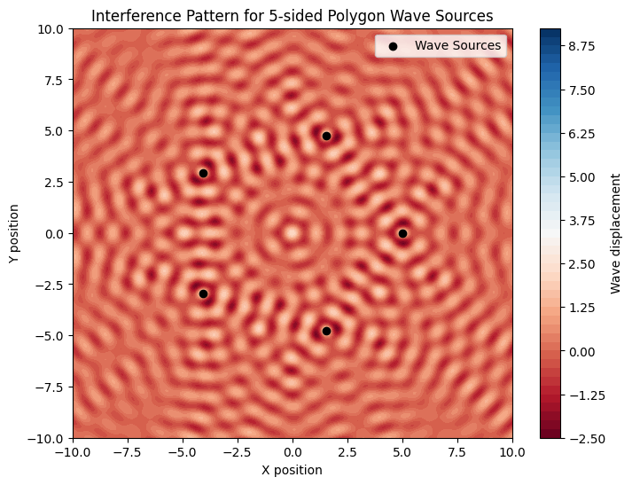
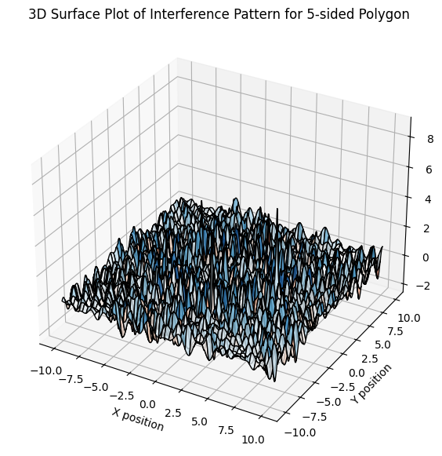

# Problem 1

# Interference Patterns on a water surface

## Motivation:
Interference occurs when waves from different sources overlap, creating new patterns. On a water surface, this can be easily observed when ripples from different points meet, forming distinctive interference patterns. These patterns can show us how waves combine in different ways, either reinforcing each other or canceling out.

Studying these patterns helps us understand wave behavior in a simple, visual way. It also allows us to explore important concepts, like the relationship between wave phase and the effects of multiple sources. This task offers a hands-on approach to learning about wave interactions and their real-world applications, making it an interesting and engaging way to dive into wave

## Task  

A circular wave on the water surface, emanating from a point source located at \((x_0, y_0)\), can be described by the Single Disturbance equation:  

\[
\eta(x, y, t) = \frac{A}{\sqrt{r}} \cdot \cos \left( kr - \omega t + \phi \right)
\]

where:  

- \(\eta(x, y, t)\) is the displacement of the water surface at point \((x, y)\) and time \(t\),  
- \(A\) is the amplitude of the wave,  
- \(k = \frac{2\pi}{\lambda}\) is the wave number, related to the wavelength \(\lambda\),  
- \(\omega = 2\pi f\) is the angular frequency, related to the frequency \(f\),  
- \(r = \sqrt{(x - x_0)^2 + (y - y_0)^2}\) is the distance from the source to the point \((x, y)\),  
- \(\phi\) is the initial phase.  


```python
import numpy as np
import matplotlib.pyplot as plt
from mpl_toolkits.mplot3d import Axes3D

# Define wave parameters
A = 1  # Amplitude
wavelength = 1  # Wavelength
k = 2 * np.pi / wavelength  # Wave number
f = 1  # Frequency
omega = 2 * np.pi * f  # Angular frequency
phi_0 = 0  # Initial phase

def polygon_vertices(n, radius=5):
    """Generate coordinates for a regular n-sided polygon centered at the origin."""
    angles = np.linspace(0, 2 * np.pi, n, endpoint=False)
    return np.array([(radius * np.cos(a), radius * np.sin(a)) for a in angles])

def wave_displacement(x, y, sources, t):
    """Compute the wave displacement at (x, y) by summing contributions from all sources."""
    displacement = np.zeros_like(x)
    for sx, sy in sources:
        r = np.sqrt((x - sx)**2 + (y - sy)**2)
        displacement += A / np.sqrt(r + 1e-6) * np.cos(k * r - omega * t + phi_0)  # Avoid division by zero
    return displacement

# Define grid
x_vals = np.linspace(-10, 10, 400)
y_vals = np.linspace(-10, 10, 400)
x, y = np.meshgrid(x_vals, y_vals)

# Choose polygon (e.g., equilateral triangle, square, pentagon)
n_sides = 5  # Change this for different polygons
sources = polygon_vertices(n_sides)

time = 0  # Fix time for a static pattern
z = wave_displacement(x, y, sources, time)

# Plot the interference pattern as a 2D heatmap
plt.figure(figsize=(8, 6))
plt.contourf(x, y, z, levels=50, cmap='RdBu')
plt.colorbar(label='Wave displacement')
plt.scatter(sources[:, 0], sources[:, 1], color='black', marker='o', label='Wave Sources')
plt.legend()
plt.title(f'Interference Pattern for {n_sides}-sided Polygon Wave Sources')
plt.xlabel('X position')
plt.ylabel('Y position')
plt.show()

# 3D Surface Plot for Better Visualization
fig = plt.figure(figsize=(10, 7))
ax = fig.add_subplot(111, projection='3d')
ax.plot_surface(x, y, z, cmap='RdBu', edgecolor='k', alpha=0.8)
ax.set_title(f'3D Surface Plot of Interference Pattern for {n_sides}-sided Polygon')
ax.set_xlabel('X position')
ax.set_ylabel('Y position')
ax.set_zlabel('Wave displacement')
plt.show()
```




### Explanation of Interference Patterns for a Regular Polygon Wave Source  

#### **1. Understanding Wave Superposition**  
When multiple wave sources emit waves simultaneously, the resulting wave pattern is determined by the **principle of superposition**. This principle states that the total displacement at any point on the water surface is the sum of the displacements caused by each individual wave.  

Mathematically, the total displacement \(\eta_{\text{total}}(x, y, t)\) is given by:  
$$
\eta_{\text{total}}(x, y, t) = \sum_{i=1}^{N} \frac{A}{\sqrt{r_i}} \cos (k r_i - \omega t + \phi)
$$
where:  
 \( N \) is the number of sources (equal to the number of polygon vertices),  
 \( A \) is the amplitude of the waves,  
 \( k = \frac{2\pi}{\lambda} \) is the wave number,  
 \( \omega = 2\pi f \) is the angular frequency,  
 \( r_i \) is the distance from the \( i \)-th source to the observation point \( (x, y) \),  
 \( \phi \) is the initial phase.  

---

#### **2. How Polygon Shape Affects Interference**  
The specific **arrangement of wave sources** affects the interference pattern:  
- **Triangle (3 sources)**: Forms a simple **three-lobed interference pattern** with well-defined constructive and destructive interference zones.  
- **Square (4 sources)**: Produces a **grid-like interference pattern**, with symmetry along both x- and y-axes.  
- **Pentagon (5 sources, default in the script)**: Introduces **circular and radial symmetry**, leading to **more intricate interference fringes**.  
- **Higher polygons (e.g., hexagon, octagon, etc.)**: As the number of sources increases, the interference pattern becomes **denser and more complex**, resembling a **circular wave diffraction pattern**.  

---

#### **3. Key Observations in the Interference Pattern**  
1. **Constructive Interference (Bright Regions in the Plot)**  
     - Occurs when waves from multiple sources **add up in phase** (peaks coincide).  
     - Forms regions of **high amplitude**, appearing as bright red zones in the plot.  
   
2. **Destructive Interference (Dark Regions in the Plot)**  
     - Occurs when waves from multiple sources **cancel out** (peak of one wave meets the trough of another).  
     - Results in **low-amplitude regions**, appearing as dark blue zones in the plot.  

3. **Symmetry and Wavefront Formation**  
     - The regular polygon's symmetry ensures a **highly structured interference pattern**.  
     - The **distance between sources** and the **wavelength** determines the spacing of the interference fringes.  
     - At certain points, **wave energy converges**, reinforcing the wave amplitude significantly.  

---

#### **4. Visualizing the Interference Pattern**  
- The **contour plot** in the Python script represents wave displacement at each point in space.  
- The **color gradient (red to blue)** indicates the magnitude of displacement—constructive vs. destructive interference.  
- The **black dots** represent the **polygon vertices (wave sources)**.  
- The pattern remains **static at a fixed time**, but if animated over time, it would reveal the **dynamic evolution of wave interactions**.  

---

### **Conclusion**  
This simulation provides a **powerful visual representation** of wave superposition. By modifying the number of polygon sides (`n_sides` in the script), we can analyze how interference patterns evolve with different wave source configurations. This understanding is crucial in fields such as **optics (diffraction patterns), acoustics (sound wave interference), and fluid dynamics (water wave interactions).** 🚀