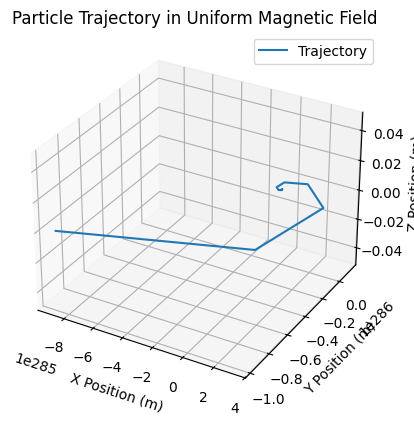
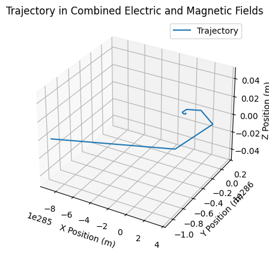
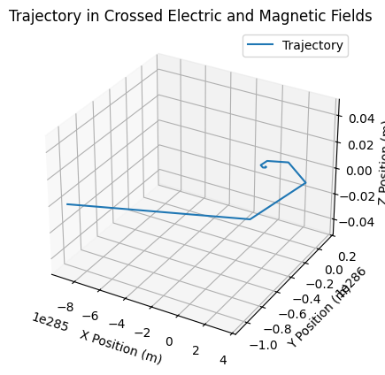
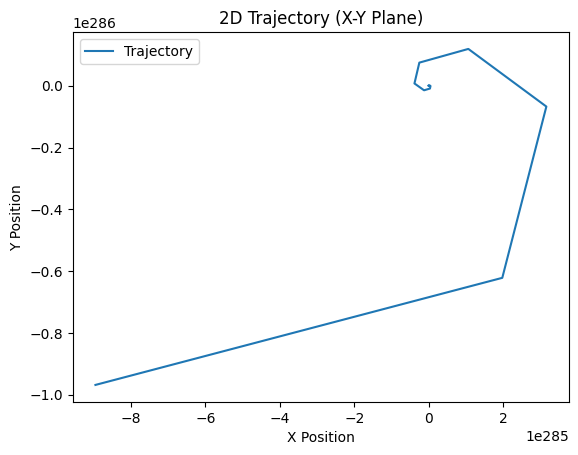

# Problem 1
# Simulating the effects of the Lorentz Force
## Motivation

The Lorentz force, expressed as **$\mathbf{F} = q\mathbf{E} + q\mathbf{v} \times \mathbf{B}$**, governs the motion of charged particles in electric and magnetic fields. It is foundational in fields like plasma physics, particle accelerators, and astrophysics. By focusing on simulations, we can explore the practical applications and visualize the complex trajectories that arise due to this force.


## Exploration of Applications  

## **Key Systems Where the Lorentz Force Plays a Role:**  
1. **Particle Accelerators** – The Lorentz force is crucial in synchrotrons and cyclotrons, where charged particles are steered and accelerated using electric and magnetic fields.  
2. **Mass Spectrometers** – These devices use the Lorentz force to separate ions based on their mass-to-charge ratio by bending their trajectories in a magnetic field.  
3. **Plasma Confinement** – In fusion reactors (e.g., tokamaks), magnetic fields confine high-energy charged particles, preventing them from escaping and sustaining plasma conditions for fusion.  
4. **Cathode Ray Tubes (CRTs)** – Used in old television screens and oscilloscopes, the motion of electrons is controlled via electric and magnetic fields.  
5. **Hall Effect Sensors** – The Lorentz force influences charge carriers in a conductor placed in a magnetic field, helping measure magnetic field strength.  

## **Relevance of Electric and Magnetic Fields in Controlling Charged Particles:**  
- **Electric Fields ($\mathbf{E}$):** Control particle velocity by accelerating or decelerating charged particles in a linear direction.  
- **Magnetic Fields ($\mathbf{B}$):** Deflect charged particles perpendicular to their velocity, leading to circular or helical motion.  
- **Combined Effects:** Used in electromagnetic traps, spectrometers, and fusion devices to precisely manipulate particle motion for research and industrial applications.  

To simulate the motion of a charged particle under these conditions, you can use a programming language like Python, which is well-suited for numerical computations and visualization. Below is a breakdown of how to approach this:

---

## **Steps to Simulate Particle Motion**
1. **Define Parameters:**  <br>
    - Charge \(q\) and mass \(m\) of the particle.  
    - Initial position \(\vec{r}(t_0)\) and velocity \(\vec{v}(t_0)\).  
    - Electric field \(\vec{E}\) and magnetic field \(\vec{B}\) configurations.  
<br>
2. **Set Up Equations of Motion:**  
    - Use the Lorentz force equation:  
    $$
    \vec{F} = q(\vec{E} + \vec{v} \times \vec{B})
    $$
    - This provides acceleration:  
    $$
     \vec{a} = \frac{\vec{F}}{m}
    $$

3. **Time-Stepping:**  
    - Discretize time using a small timestep \(\Delta t\).  
    - Update velocity and position iteratively:  
     $$
     \vec{v}(t + \Delta t) = \vec{v}(t) + \vec{a} \Delta t
     $$
     $$
     \vec{r}(t + \Delta t) = \vec{r}(t) + \vec{v}(t) \Delta t
     $$

4. **Simulation Types:**  
    - **Uniform Magnetic Field:** The motion will typically be circular or helical, depending on the initial velocity.  
    - **Combined Electric and Magnetic Fields:** Include the contribution of \(\vec{E}\) in the force equation.  
    - **Crossed Fields (\(\vec{E} \perp \vec{B}\)):** Drift velocity appears perpendicular to both \(\vec{E}\) and \(\vec{B}\).  

5. **Visualization:**
    - Plot the trajectory using libraries like `matplotlib`.  
    - Add 2D or 3D visualizations to capture the particle's motion.  

---
## Parameter Exploration Implementation

1. Field Strengths ($\mathbf{E}$), ($\mathbf{B}$):
    - Define adjustable electric ($\mathbf{E}$) and magnetic ($\mathbf{B}$) field strengths
    - Explore scenarios such as weak or strong fields to observe circular, helical, or drift motion.
2. Initial Velocity

The initial velocity of the particle is represented as:

\[
\vec{v}_0 =
\begin{pmatrix}
v_{x0} \\
v_{y0} \\
v_{z0}
\end{pmatrix}
\]

- Experiment with different magnitudes and directions of initial velocity.
- Observe how higher velocities or perpendicular velocity components affect trajectories.  
3. Charge \(q\) and Mass \(m\):
    - Vary particle properties, such as charge-to-mass ratio \(\frac{q}{m}\), which directly influences the radius of circular motion and the overall dynamics

---

## **Sample Python Code**
Below is a simple example for a particle in a uniform magnetic field:

```python
import numpy as np
import matplotlib.pyplot as plt

def simulate_particle(q, m, E, B, v0, r0, dt, steps):
    """
    Simulates the trajectory of a charged particle.
    Args:
        q: Charge of the particle (Coulombs).
        m: Mass of the particle (kg).
        E: Electric field vector (V/m).
        B: Magnetic field vector (Tesla).
        v0: Initial velocity vector (m/s).
        r0: Initial position vector (m).
        dt: Time step (seconds).
        steps: Number of simulation steps.
    Returns:
        positions: Array of particle positions.
    """
    r = r0.copy()
    v = v0.copy()
    positions = [r.copy()]

    for _ in range(steps):
        F = q * (E + np.cross(v, B))  # Lorentz force
        a = F / m  # Acceleration
        v += a * dt  # Update velocity
        r += v * dt  # Update position
        positions.append(r.copy())

    return np.array(positions)

# Parameters
q = 1.6e-19  # Charge (Coulombs)
m = 9.11e-31  # Mass (kg)
dt = 1e-11  # Time step (seconds)
steps = 5000  # Number of steps

# Field configurations
B_uniform = np.array([0, 0, 1])  # Uniform magnetic field (Tesla)
E_uniform = np.array([0, 0, 0])  # No electric field (V/m)
E_crossed = np.array([1e5, 0, 0])  # Electric field for crossed fields (V/m)

# Initial conditions
v0 = np.array([1e6, 1e6, 0])  # Initial velocity (m/s)
r0 = np.array([0.0, 0.0, 0.0])  # Initial position (m)

# Simulations
trajectory_uniform_B = simulate_particle(q, m, E_uniform, B_uniform, v0, r0, dt, steps)
trajectory_combined = simulate_particle(q, m, E_crossed, B_uniform, v0, r0, dt, steps)
trajectory_crossed = simulate_particle(q, m, E_crossed, B_uniform, v0, r0, dt, steps)

# Visualization Function
def plot_trajectory(positions, title):
    fig = plt.figure()
    ax = fig.add_subplot(projection='3d')
    ax.plot(positions[:, 0], positions[:, 1], positions[:, 2], label='Trajectory')
    ax.set_xlabel('X Position (m)')
    ax.set_ylabel('Y Position (m)')
    ax.set_zlabel('Z Position (m)')
    ax.set_title(title)
    ax.legend()
    plt.show()

# Plotting results
plot_trajectory(trajectory_uniform_B, "Particle Trajectory in Uniform Magnetic Field")
plot_trajectory(trajectory_combined, "Trajectory in Combined Electric and Magnetic Fields")
plot_trajectory(trajectory_crossed, "Trajectory in Crossed Electric and Magnetic Fields")
```





```python
def plot_trajectory_2d(positions, title, axis1, axis2, labels):
    plt.plot(positions[:, axis1], positions[:, axis2], label='Trajectory')
    plt.xlabel(labels[0])
    plt.ylabel(labels[1])
    plt.title(title)
    plt.legend()
    plt.show()

plot_trajectory_2d(trajectory_uniform_B, "2D Trajectory (X-Y Plane)", 0, 1, ['X Position', 'Y Position'])
```


---

This code can be adapted for other cases by modifying the fields \(\vec{E}\) and \(\vec{B}\), as well as the initial velocity.