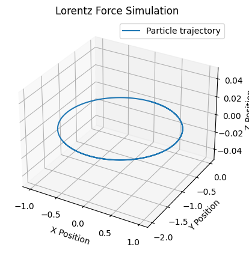

# Problem 1
# Simulating the effects of the Lorentz Force

The **Lorentz Force** governs the motion of charged particles in electric and magnetic fields. It is defined as:

\[
\mathbf{F} = q (\mathbf{E} + \mathbf{v} \times \mathbf{B})
\]

Where:  

- \( q \) is the charge of the particle.
- \( \mathbf{E} \) is the electric field vector.
- \( \mathbf{v} \) is the velocity vector of the particle.
- \( \mathbf{B} \) is the magnetic field vector.

## Exploration of Applications  

## **Key Systems Where the Lorentz Force Plays a Role:**  
1. **Particle Accelerators** – The Lorentz force is crucial in synchrotrons and cyclotrons, where charged particles are steered and accelerated using electric and magnetic fields.  
2. **Mass Spectrometers** – These devices use the Lorentz force to separate ions based on their mass-to-charge ratio by bending their trajectories in a magnetic field.  
3. **Plasma Confinement** – In fusion reactors (e.g., tokamaks), magnetic fields confine high-energy charged particles, preventing them from escaping and sustaining plasma conditions for fusion.  
4. **Cathode Ray Tubes (CRTs)** – Used in old television screens and oscilloscopes, the motion of electrons is controlled via electric and magnetic fields.  
5. **Hall Effect Sensors** – The Lorentz force influences charge carriers in a conductor placed in a magnetic field, helping measure magnetic field strength.  

## **Relevance of Electric and Magnetic Fields in Controlling Charged Particles:**  
- **Electric Fields ($\mathbf{E}$):** Control particle velocity by accelerating or decelerating charged particles in a linear direction.  
- **Magnetic Fields ($\mathbf{B}$):** Deflect charged particles perpendicular to their velocity, leading to circular or helical motion.  
- **Combined Effects:** Used in electromagnetic traps, spectrometers, and fusion devices to precisely manipulate particle motion for research and industrial applications.  


---

## **Steps to Simulate Particle Motion**
1. **Define Parameters:**  <br>
    - Charge \(q\) and mass \(m\) of the particle.  
    - Initial position \(\vec{r}(t_0)\) and velocity \(\vec{v}(t_0)\).  
    - Electric field \(\vec{E}\) and magnetic field \(\vec{B}\) configurations.  
<br>
2. **Set Up Equations of Motion:**  
    - Use the Lorentz force equation:  
    $$
    \vec{F} = q(\vec{E} + \vec{v} \times \vec{B})
    $$
    - This provides acceleration:  
    $$
     \vec{a} = \frac{\vec{F}}{m}
    $$

3. **Time-Stepping:**  
    - Discretize time using a small timestep \(\Delta t\).  
    - Update velocity and position iteratively:  
     $$
     \vec{v}(t + \Delta t) = \vec{v}(t) + \vec{a} \Delta t
     $$
     $$
     \vec{r}(t + \Delta t) = \vec{r}(t) + \vec{v}(t) \Delta t
     $$

4. **Simulation Types:**  
    - **Uniform Magnetic Field:** The motion will typically be circular or helical, depending on the initial velocity.  
    - **Combined Electric and Magnetic Fields:** Include the contribution of \(\vec{E}\) in the force equation.  
    - **Crossed Fields (\(\vec{E} \perp \vec{B}\)):** Drift velocity appears perpendicular to both \(\vec{E}\) and \(\vec{B}\).  

5. **Visualization:**
    - Plot the trajectory using libraries like `matplotlib`.  
    - Add 2D or 3D visualizations to capture the particle's motion.  

---
## Parameter Exploration Implementation

1. Field Strengths ($\mathbf{E}$), ($\mathbf{B}$):
    - Define adjustable electric ($\mathbf{E}$) and magnetic ($\mathbf{B}$) field strengths
    - Explore scenarios such as weak or strong fields to observe circular, helical, or drift motion.
2. Initial Velocity

The initial velocity of the particle is represented as:

\[
\vec{v}_0 =
\begin{pmatrix}
v_{x0} \\
v_{y0} \\
v_{z0}
\end{pmatrix}
\]

- Experiment with different magnitudes and directions of initial velocity.
- Observe how higher velocities or perpendicular velocity components affect trajectories.  
3. Charge \(q\) and Mass \(m\):
    - Vary particle properties, such as charge-to-mass ratio \(\frac{q}{m}\), which directly influences the radius of circular motion and the overall dynamics


This script numerically solves the equations of motion and visualizes the trajectory of a charged particle.

---

## **Sample Python Code**
Below is a simple example for a particle in a uniform magnetic field:

```python
import numpy as np
import numpy as np
import matplotlib.pyplot as plt
from scipy.integrate import solve_ivp

# Define Lorentz Force function
def lorentz_force(t, y, q, m, E, B):
    position = y[:3]  # x, y, z coordinates
    velocity = y[3:]  # vx, vy, vz

    # Compute force
    force = q * (E + np.cross(velocity, B))
    
    # Newton's second law
    acceleration = force / m
    
    return np.concatenate([velocity, acceleration])  # Return velocity and acceleration

# Parameters
q = 1.0      # Charge (Coulombs)
m = 1.0      # Mass (kg)
E = np.array([0, 0, 0])  # Electric field (V/m)
B = np.array([0, 0, 1])  # Magnetic field (T)

# Initial conditions
initial_position = np.array([0, 0, 0])
initial_velocity = np.array([1, 0, 0])
initial_state = np.concatenate([initial_position, initial_velocity])

# Time span
t_span = (0, 10)
t_eval = np.linspace(*t_span, 1000)

# Solve ODE
solution = solve_ivp(lorentz_force, t_span, initial_state, args=(q, m, E, B), t_eval=t_eval)

# Extract results
x, y, z = solution.y[:3]

# Plot trajectory
fig = plt.figure()
ax = fig.add_subplot(111, projection='3d')
ax.plot(x, y, z, label="Particle trajectory")
ax.set_xlabel("X Position")
ax.set_ylabel("Y Position")
ax.set_zlabel("Z Position")
ax.legend()
plt.title("Lorentz Force Simulation")
plt.show()
```


---

This code can be adapted for other cases by modifying the fields \(\vec{E}\) and \(\vec{B}\), as well as the initial velocity.