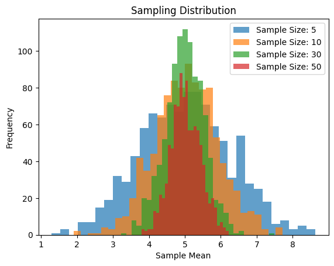

# Problem 1

# Exploring the Central Limit Theorem through simulations

## Motivation
The Central Limit Theorem (CLT) is a cornerstone of probability and statistics, stating that the sampling distribution of the sample mean approaches a normal distribution as the sample size increases, regardless of the population’s original distribution. Simulations provide an intuitive and hands-on way to observe this phenomenon in action.


Here are the steps for CLT.

Step 1: Simulating Sampling Distributions
Start by generating data for three distinct population distributions:
1. **Uniform distribution**: Use `numpy.random.uniform`.
2. **Exponential distribution**: Use `numpy.random.exponential`.
3. **Binomial distribution**: Use `numpy.random.binomial`.

For example:
```python
import numpy as np

# Uniform Distribution
uniform_population = np.random.uniform(0, 10, size=10000)

# Exponential Distribution
exponential_population = np.random.exponential(scale=2, size=10000)

# Binomial Distribution
binomial_population = np.random.binomial(n=20, p=0.5, size=10000)

# Display some basic information
print("Uniform Distribution - Mean:", np.mean(uniform_population), "Variance:", np.var(uniform_population))
print("Exponential Distribution - Mean:", np.mean(exponential_population), "Variance:", np.var(exponential_population))
print("Binomial Distribution - Mean:", np.mean(binomial_population), "Variance:", np.var(binomial_population))
```

```
Output:
Uniform Distribution - Mean: 4.975929262881268 Variance: 8.190846855965992
Exponential Distribution - Mean: 1.991324170407097 Variance: 3.8778654541766895
Binomial Distribution - Mean: 10.0012 Variance: 4.98579856
```

Step 2: Sampling and Visualization
Create a function to:
- Draw random samples of different sizes.
- Compute the sample mean multiple times.
- Plot histograms of sample means.

```python
import matplotlib.pyplot as plt

def sampling_distribution(population, sample_sizes, num_samples=1000):
    for size in sample_sizes:
        sample_means = [np.mean(np.random.choice(population, size, replace=False)) for _ in range(num_samples)]
        plt.hist(sample_means, bins=30, alpha=0.7, label=f'Sample Size: {size}')
    
    plt.title('Sampling Distribution')
    plt.xlabel('Sample Mean')
    plt.ylabel('Frequency')
    plt.legend()
    plt.show()

# Example usage
sample_sizes = [5, 10, 30, 50]
sampling_distribution(uniform_population, sample_sizes)
```


Step 3: Parameter Exploration
Analyze how different population shapes and variances affect the rate of convergence to normality. Experiment with changing:
- The range of the uniform distribution.
- The scale parameter of the exponential distribution.
- The number of trials and probability in the binomial distribution.

Step 4: Reflecting on Real-World Applications
Discuss how the CLT applies in practical contexts. For instance:
- **Estimating population parameters**: The CLT allows confidence intervals and hypothesis tests to be applied even if the population distribution is unknown.
- **Quality control**: Understanding the distribution of sample means helps ensure manufacturing processes stay within control limits.
- **Financial models**: Aggregating returns over time benefits from CLT, assuming independence and identical distributions.


The Central Limit Theorem (CLT) is an elegant demonstration of how sample means tend to form a normal distribution as the sample size increases, regardless of the population's initial distribution. Through this exploration, we observed the following key insights:

1. **Population Shape**: While the original distribution can vary widely (uniform, exponential, binomial), the sampling distribution of the sample mean converges toward normality as the sample size grows.
   
2. **Sample Size Effect**: Larger sample sizes accelerate convergence, making the sampling distribution more symmetric and concentrated around the true population mean.

3. **Impact of Variance**: Populations with higher variance produce sampling distributions with greater spread, underscoring the role of variability in shaping statistical outcomes.

4. **Real-World Importance**: The CLT has profound implications across fields like quality control, finance, and hypothesis testing, providing a robust foundation for statistical reasoning even when data distributions are unknown.

In conclusion, simulations vividly illustrate the CLT's theoretical principles, transforming abstract concepts into tangible patterns. This hands-on approach enriches understanding, showcasing the theorem's universal applicability and reinforcing its importance in data science, research, and practical problem-solving. 
