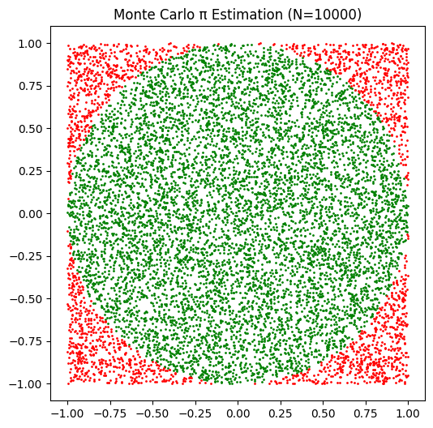
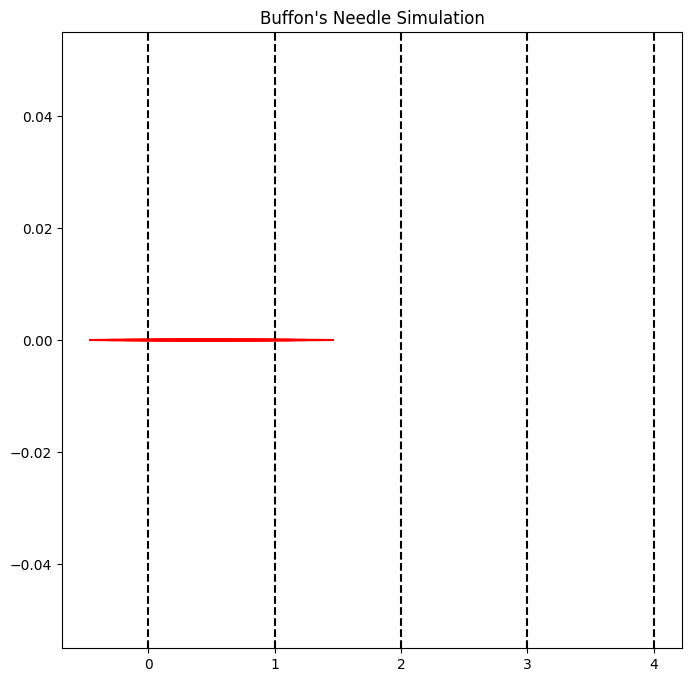

# Problem 2

# Estimating Pi using Monte Carlo Methods

## Motivation

Monte Carlo simulations are a powerful class of computational techniques that use randomness to solve problems or estimate values. One of the most elegant applications of Monte Carlo methods is estimating the value $\pi$ of through geometric probability. By randomly generating points and analyzing their positions relative to a geometric shape, we can approximate $\pi$ in an intuitive and visually engaging way.

This problem connects fundamental concepts of probability, geometry, and numerical computation. It also provides a gateway to understanding how randomness can be harnessed to solve complex problems in physics, finance, and computer science. The Monte Carlo approach to $\pi$ estimation highlights the versatility and simplicity of this method while offering practical insights into convergence rates and computational efficiency.

The Monte Carlo method to estimate π is indeed fascinating! Here's an overview and guidance to help you accomplish each part of this task.

## Task 1: Estimating Using a Circle

### **Theoretical Foundation**
The technique leverages the geometric probability of points in a square and circle:  

1. Consider a unit circle with radius \( r = 1 \) inscribed in a square of side length \( 2r = 2 \).  

2. The area of the circle is \( \pi r^2 = \pi \), and the area of the square is \( 4r^2 = 4 \).  

3. If we randomly distribute points within the square, the proportion of points falling inside the circle compared to the total points in the square approximates the ratio of the areas:  

   $$
   \text{Ratio} = \frac{\text{Points inside the circle}}{\text{Total points in the square}} \approx \frac{\text{Area of the circle}}{\text{Area of the square}} = \frac{\pi}{4}
   $$

4. Therefore, we can estimate \( \pi \) as:  

   $$
   \pi \approx 4 \times \frac{\text{Points inside the circle}}{\text{Total points}}
   $$  


### **Simulation**
Here's a step-by-step guide:  

1. **Random Point Generation:**
     - Generate random (x, y) coordinates within the square \( [-1, 1] \times [-1, 1] \).  
     - Ensure randomness by using functions like `random.uniform(-1, 1)` in Python.  

2. **Circle Membership Check:**  
     - Use the equation \( x^2 + y^2 \leq 1 \) to determine if a point lies inside the circle.  
     - Count the number of points satisfying this condition.  

3. **π Estimation:**  
     - Apply the formula \( \pi \approx 4 \times \frac{\text{Points inside the circle}}{\text{Total points}} \).  
   

Example Python snippet:
```python
import matplotlib.pyplot as plt
import random

N = 10000  # Number of random points
points_inside = 0
x_inside, y_inside, x_outside, y_outside = [], [], [], []

for _ in range(N):
    x, y = random.uniform(-1, 1), random.uniform(-1, 1)
    if x**2 + y**2 <= 1:
        points_inside += 1
        x_inside.append(x)
        y_inside.append(y)
    else:
        x_outside.append(x)
        y_outside.append(y)

# Estimation of π
pi_estimate = 4 * points_inside / N
print(f"Estimated π: {pi_estimate}")

# Visualization
plt.figure(figsize=(6, 6))
plt.scatter(x_inside, y_inside, color="green", s=1)
plt.scatter(x_outside, y_outside, color="red", s=1)
plt.gca().set_aspect("equal", adjustable="box")
plt.title(f"Monte Carlo π Estimation (N={N})")
plt.show()
```
Estimated π: 3.1412


### **Analysis**
1. **Accuracy Improvement:**  
     - The accuracy of the π estimate increases with more points due to the law of large numbers.
2. **Convergence Rate:**  
     - Convergence is proportional to \( \frac{1}{\sqrt{N}} \), where \( N \) is the number of points.  
     - For higher precision, use a larger \( N \), but note that computational time also increases.
3. **Considerations:**  
     - Randomness quality affects the accuracy; use high-quality pseudorandom number generators.  
     - Parallelization can speed up computations for large \( N \).

## Task 2: Estimating Buffon's Needle


### 1. Theoretical Foundation
**Buffon's Needle Problem**:
- The problem involves dropping a needle of length \(L\) onto a plane with parallel lines spaced \(D\) units apart (\(D \geq L\)).
- The probability \(P\) that the needle crosses a line is given by:
  \[
  P = \frac{2L}{\pi D}
  \]
- Rearranging, π can be estimated as:
  \[
  \pi \approx \frac{2L \cdot n}{D \cdot h}
  \]
  where:
  - \(n\) = Total number of needle drops
  - \(h\) = Number of times the needle crosses a line.

---

### 2. Simulation
**Steps**:
1. Randomly generate the position and orientation of the needle.
2. Calculate whether the needle crosses a line based on its center position and angle.
3. Repeat for a large number of drops (\(n\)).
4. Use the formula to estimate π.

**Python Implementation**:
Here's an example snippet for the Buffon's Needle simulation:

```python
import numpy as np

def buffons_needle_simulation(needle_length, line_spacing, num_trials):
    crosses = 0
    for _ in range(num_trials):
        # Random center position and angle
        center = np.random.uniform(0, line_spacing / 2)  # Center is within half-spacing
        angle = np.random.uniform(0, np.pi)  # Angle between 0 and π
        # Check if needle crosses a line
        if center <= (needle_length / 2) * np.sin(angle):
            crosses += 1
    # Estimate π
    if crosses > 0:
        pi_estimate = (2 * needle_length * num_trials) / (line_spacing * crosses)
    else:
        pi_estimate = None
    return pi_estimate

# Parameters
needle_length = 1.0
line_spacing = 2.0
num_trials = 10000
pi_estimate = buffons_needle_simulation(needle_length, line_spacing, num_trials)
print(f"Estimated π: {pi_estimate}")
```
```
Output:
Estimated π: 3.119151590767311
```
---

### 3. Visualization
**Plot the Simulation**:
You can create a graphical representation using Matplotlib, showing the needle positions relative to the lines.

Example for visualization:
```python
import matplotlib.pyplot as plt

def visualize_simulation(needle_length, line_spacing, num_needles):
    fig, ax = plt.subplots(figsize=(8, 8))
    for _ in range(num_needles):
        center = np.random.uniform(0, line_spacing / 2)
        angle = np.random.uniform(0, np.pi)
        # Needle end points
        x1 = center - (needle_length / 2) * np.cos(angle)
        x2 = center + (needle_length / 2) * np.cos(angle)
        y = [0, 0]
        ax.plot([x1, x2], y, 'r-')
    # Plot lines
    for i in range(5):  # Adjust for spacing
        ax.axvline(i * line_spacing / 2, color='k', linestyle='--')
    plt.title("Buffon's Needle Simulation")
    plt.show()

visualize_simulation(needle_length=1.0, line_spacing=2.0, num_needles=100)
```


---

### 4. Analysis
**Convergence of π**:
Run simulations with increasing numbers of needle drops. Record the estimates and plot the convergence.

Example:

```python
import matplotlib.pyplot as plt

def analyze_convergence(needle_length, line_spacing, max_trials):
    estimates = []
    trials = []
    for num_trials in range(100, max_trials + 1, 100):
        pi_estimate = buffons_needle_simulation(needle_length, line_spacing, num_trials)
        estimates.append(pi_estimate)
        trials.append(num_trials)
    plt.plot(trials, estimates, marker='o')
    plt.axhline(np.pi, color='red', linestyle='--', label="True π")
    plt.xlabel("Number of Trials")
    plt.ylabel("Estimated π")
    plt.title("Convergence of π Estimation")
    plt.legend()
    plt.show()

analyze_convergence(needle_length=1.0, line_spacing=2.0, max_trials=10000)
```

