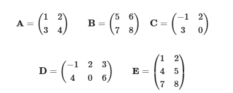

# Linear Algebra

## 1. Basic Operations on Matrices

## Given Matrices:

---

## **1. Calculations:**
### 1.1) \(A + B\)
$$
A + B = \begin{pmatrix} 1 + 5 & 2 + 6 \\ 3 + 7 & 4 + 8 \end{pmatrix} = \begin{pmatrix} 6 & 8 \\ 10 & 12 \end{pmatrix}
$$

### 1.2) \(B - A\)
$$
B - A = \begin{pmatrix} 5 - 1 & 6 - 2 \\ 7 - 3 & 8 - 4 \end{pmatrix} = \begin{pmatrix} 4 & 4 \\ 4 & 4 \end{pmatrix}
$$

### 1.3) \(A + C\)
$$
A + C = \begin{pmatrix} 1 + (-1) & 2 + 2 \\ 3 + 3 & 4 + 0 \end{pmatrix} = \begin{pmatrix} 0 & 4 \\ 6 & 4 \end{pmatrix}
$$

### 1.4) \(D + E\) (not possible)
- **Matrix addition requires equal dimensions.** Since \(D\) is \(2 \times 3\) and \(E\) is \(3 \times 2\), matrix addition is **not defined**.

---

## **2. Scalar Multiplications:**
### 2.1) \(\frac{1}{2} A\)
$$
\frac{1}{2} A = \frac{1}{2} \begin{pmatrix} 1 & 2 \\ 3 & 4 \end{pmatrix} = \begin{pmatrix} 0.5 & 1 \\ 1.5 & 2 \end{pmatrix}
$$

### 2.2) \(2 B\)
$$
2 B = 2 \begin{pmatrix} 5 & 6 \\ 7 & 8 \end{pmatrix} = \begin{pmatrix} 10 & 12 \\ 14 & 16 \end{pmatrix}
$$

### 2.3) \(-3 C\)
$$
-3 C = -3 \begin{pmatrix} -1 & 2 \\ 3 & 0 \end{pmatrix} = \begin{pmatrix} 3 & -6 \\ -9 & 0 \end{pmatrix}
$$

### 2.4) \(4 D\)
$$
4 D = 4 \begin{pmatrix} -1 & 2 & 3 \\ 4 & 0 & 6 \end{pmatrix} = \begin{pmatrix} -4 & 8 & 12 \\ 16 & 0 & 24 \end{pmatrix}
$$

---

## **3. Matrix Multiplications:**

### **3.1) \( A \cdot B \):**

$$
A \cdot B = 
\begin{pmatrix} 
1 & 2 \\ 
3 & 4 
\end{pmatrix}
\cdot 
\begin{pmatrix} 
5 & 6 \\ 
7 & 8 
\end{pmatrix}
$$

\[
= 
\begin{pmatrix} 
(1 \cdot 5 + 2 \cdot 7) & (1 \cdot 6 + 2 \cdot 8) \\ 
(3 \cdot 5 + 4 \cdot 7) & (3 \cdot 6 + 4 \cdot 8) 
\end{pmatrix}
= 
\begin{pmatrix} 
19 & 22 \\ 
43 & 50 
\end{pmatrix}
\]

---

### **3.2) \( B \cdot A \):**

\[
B \cdot A = 
\begin{pmatrix} 
5 & 6 \\ 
7 & 8 
\end{pmatrix}
\cdot 
\begin{pmatrix} 
1 & 2 \\ 
3 & 4 
\end{pmatrix}
\]

\[
= 
\begin{pmatrix} 
(5 \cdot 1 + 6 \cdot 3) & (5 \cdot 2 + 6 \cdot 4) \\ 
(7 \cdot 1 + 8 \cdot 3) & (7 \cdot 2 + 8 \cdot 4) 
\end{pmatrix}
= 
\begin{pmatrix} 
23 & 34 \\ 
31 & 46 
\end{pmatrix}
\]

---

### **3.3) \( A \cdot D \):**

- Matrix multiplication requires the number of columns in \( A \) to equal the number of rows in \( D \).
- Since \( A \) is \( 2 \times 2 \) and \( D \) is \( 2 \times 3 \), **matrix multiplication is not defined**.

---

### **3.4) \( D \cdot E \):**

\[
D \cdot E = 
\begin{pmatrix} 
-1 & 2 & 3 \\ 
4 & 0 & 6 
\end{pmatrix}
\cdot 
\begin{pmatrix} 
1 & 2 \\ 
4 & 5 \\ 
7 & 8 
\end{pmatrix}
\]

\[
= 
\begin{pmatrix} 
(-1 \cdot 1 + 2 \cdot 4 + 3 \cdot 7) & (-1 \cdot 2 + 2 \cdot 5 + 3 \cdot 8) \\ 
(4 \cdot 1 + 0 \cdot 4 + 6 \cdot 7) & (4 \cdot 2 + 0 \cdot 5 + 6 \cdot 8) 
\end{pmatrix}
\]

\[
= 
\begin{pmatrix} 
34 & 40 \\ 
46 & 56 
\end{pmatrix}
\]

---

## 2. Determinants 2x2 and 3x3

### **1. Matrix \(A\):**
$$
A =
\begin{pmatrix}
2 & 3 \\
1 & 4
\end{pmatrix}
$$

The determinant of a 2x2 matrix is calculated as:

$$
\text{det}(A) = (2 \cdot 4) - (3 \cdot 1) = 8 - 3 = 5
$$  

### **2. Matrix \(B\):**  
$$
B = 
\begin{pmatrix} 
5 & 6 \\ 
7 & 8 
\end{pmatrix}
$$

The determinant of matrix \(B\) is calculated as:

$$
\text{det}(B) = (5 \cdot 8) - (6 \cdot 7) = 40 - 42 = -2
$$  

### **3. Matrix \(C\):**  
$$
C = 
\begin{pmatrix} 
-1 & 2 \\ 
3 & 0 
\end{pmatrix}
$$
$$
\text{det}(C) = (-1 \cdot 0) - (2 \cdot 3) = 0 - 6 = -6
$$

---

## Determinants of 3x3 Matrices:

### **4. Matrix \(D\):**
$$
D = 
\begin{pmatrix} 
1 & 0 & 2 \\ 
-1 & 3 & 1 \\ 
2 & 4 & -2 
\end{pmatrix}
$$
The determinant of a 3x3 matrix is calculated using cofactor expansion:
$$
\text{det}(D) = 1 \cdot 
\begin{vmatrix} 
3 & 1 \\ 
4 & -2 
\end{vmatrix}
- 0 \cdot 
\begin{vmatrix} 
-1 & 1 \\ 
2 & -2 
\end{vmatrix}
+ 2 \cdot 
\begin{vmatrix} 
-1 & 3 \\ 
2 & 4 
\end{vmatrix}
$$
$$
\text{det}(D) = 1 \cdot ((3 \cdot -2) - (1 \cdot 4)) + 2 \cdot ((-1 \cdot 4) - (3 \cdot 2))
$$
$$
\text{det}(D) = 1 \cdot (-6 - 4) + 2 \cdot (-4 - 6) = -10 + 2 \cdot -10 = -10 - 20 = -30
$$

### **5. Matrix \(E\):**
$$
E = 
\begin{pmatrix} 
3 & 1 & -1 \\ 
0 & 2 & 4 \\ 
5 & 3 & 2 
\end{pmatrix}
$$
$$
\text{det}(E) = 3 \cdot 
\begin{vmatrix} 
2 & 4 \\ 
3 & 2 
\end{vmatrix}
- 1 \cdot 
\begin{vmatrix} 
0 & 4 \\ 
5 & 2 
\end{vmatrix}
+ (-1) \cdot 
\begin{vmatrix} 
0 & 2 \\ 
5 & 3 
\end{vmatrix}
$$
$$
\text{det}(E) = 3 \cdot ((2 \cdot 2) - (4 \cdot 3)) - 1 \cdot ((0 \cdot 2) - (4 \cdot 5)) - 1 \cdot ((0 \cdot 3) - (2 \cdot 5))
$$
$$
\text{det}(E) = 3 \cdot (4 - 12) - (0 - 20) - (0 - 10)
$$
$$
\text{det}(E) = 3 \cdot -8 - 20 - 10 = -24 - 20 - 10 = -54
$$

### **6. Matrix \(F\):**
$$
F = 
\begin{pmatrix} 
2 & -3 & 1 \\ 
1 & 4 & -2 \\ 
1 & 5 & 3 
\end{pmatrix}
$$
$$
\text{det}(F) = 2 \cdot 
\begin{vmatrix} 
4 & -2 \\ 
5 & 3 
\end{vmatrix}
- (-3) \cdot 
\begin{vmatrix} 
1 & -2 \\ 
1 & 3 
\end{vmatrix}
+ 1 \cdot 
\begin{vmatrix} 
1 & 4 \\ 
1 & 5 
\end{vmatrix}
$$
$$
\text{det}(F) = 2 \cdot ((4 \cdot 3) - (-2 \cdot 5)) + 3 \cdot ((1 \cdot 3) - (-2 \cdot 1)) + 1 \cdot ((1 \cdot 5) - (4 \cdot 1))
$$
$$
\text{det}(F) = 2 \cdot (12 + 10) + 3 \cdot (3 + 2) + 1 \cdot (5 - 4)
$$
$$
\text{det}(F) = 2 \cdot 22 + 3 \cdot 5 + 1 \cdot 1 = 44 + 15 + 1 = 60
$$

---

### Final Results:

1. **2x2 Matrices:**
   - \(\text{det}(A) = 5\)
   - \(\text{det}(B) = -2\)
   - \(\text{det}(C) = -6\)

2. **3x3 Matrices:**
   - \(\text{det}(D) = -30\)
   - \(\text{det}(E) = -54\)
   - \(\text{det}(F) = 60\)
