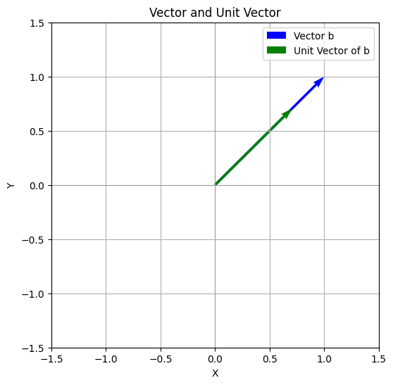
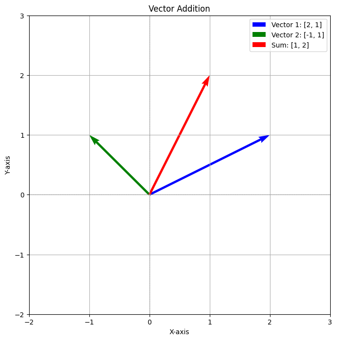
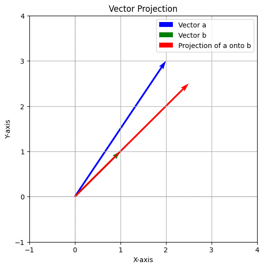
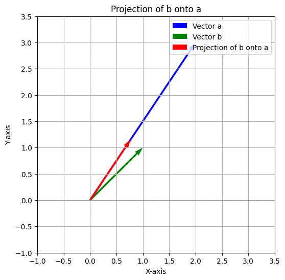

# Analytic geometry

## Vectors I


### Problem 1
**Question:** By what number should vector **a** = [3, 4] be multiplied so that its length is equal to 1?

**Solution:**  
1. The length of a vector **v** = [x, y] is calculated as:  

\[
\|v\| = \sqrt{x^2 + y^2}
\]  

For vector **a** = [3, 4]:  

\[
\|a\| = \sqrt{3^2 + 4^2} = \sqrt{9 + 16} = 5
\]  


2. To make the length of the vector equal to 1, divide each component of the vector by its length:  

\[
\text{Multiplier} = \frac{1}{\|a\|} = \frac{1}{5}
\]  


**Answer:** Vector **a** should be multiplied by  \( \frac{1}{5} \).

---

### Problem 2
**Question:** Calculate the length of vector **b** = [1, 1] and find the unit vector of this vector.

**Solution:**
1. The length of vector **b** is:  

\[
\|b\| = \sqrt{1^2 + 1^2} = \sqrt{1 + 1} = \sqrt{2}
\]

2. The unit vector of **b** is obtained by dividing each component of the vector by its length:  

\[
\text{Unit vector of } \mathbf{b} = \frac{\mathbf{b}}{\|b\|} = \frac{1}{\sqrt{2}}[1, 1] = \left[\frac{1}{\sqrt{2}}, \frac{1}{\sqrt{2}}\right]
\]

**Answer:** Length of **b** = \( \sqrt{2} \), Unit vector of **b** = \([ \frac{1}{\sqrt{2}}, \frac{1}{\sqrt{2}} ]\).

---

### Problem 3
**Question:** Plot the vector and the unit vector from the previous exercise.

**Solution:** 
To visualize, plot the vector **b** = [1, 1] and its unit vector \([ \frac{1}{\sqrt{2}}, \frac{1}{\sqrt{2}} ]\) on a Cartesian plane. The unit vector will have the same direction as **b**, but its length will be 1.


```python
import matplotlib.pyplot as plt
import numpy as np

# Define the vector and its unit vector
vector_b = np.array([1, 1])
unit_vector_b = vector_b / np.linalg.norm(vector_b)

# Create a figure and axis
plt.figure(figsize=(6, 6))
plt.axhline(0, color='gray', linewidth=0.5, linestyle='--')
plt.axvline(0, color='gray', linewidth=0.5, linestyle='--')

# Plot the vector b
plt.quiver(0, 0, vector_b[0], vector_b[1], angles='xy', scale_units='xy', scale=1, color='blue', label='Vector b')

# Plot the unit vector of b
plt.quiver(0, 0, unit_vector_b[0], unit_vector_b[1], angles='xy', scale_units='xy', scale=1, color='green', label='Unit Vector of b')

# Set plot limits
plt.xlim(-1.5, 1.5)
plt.ylim(-1.5, 1.5)

# Add labels, legend, and title
plt.legend()
plt.grid()
plt.title("Vector and Unit Vector")
plt.xlabel("X")
plt.ylabel("Y")

# Show the plot
plt.show()
```



---

### Problem 4
**Question:** Calculate the length of vector **c** = [1, 2, 3] and find the unit vector of this vector.

**Solution:**
1. The length of vector **c** is:  

\[
\|c\| = \sqrt{1^2 + 2^2 + 3^2} = \sqrt{1 + 4 + 9} = \sqrt{14}
\]  


2. The unit vector of **c** is:  

\[
\text{Unit vector of } \mathbf{c} = \frac{\mathbf{c}}{\|c\|} = \frac{1}{\sqrt{14}}[1, 2, 3] = \left[\frac{1}{\sqrt{14}}, \frac{2}{\sqrt{14}}, \frac{3}{\sqrt{14}}\right]
\]  


**Answer:** Length of **c** = \( \sqrt{14} \), Unit vector of **c** = \([ \frac{1}{\sqrt{14}}, \frac{2}{\sqrt{14}}, \frac{3}{\sqrt{14}} ]\).

---

### Problem 5
**Question:** Find the Cartesian coordinates of vector **v** = [2, 3, 4] in the basis:  

\[
\{\mathbf{b_1} = [1, 0, 1], \mathbf{b_2} = [0, 1, 0], \mathbf{b_3} = [1, 0, -1]\}.
\]

**Solution:**
Let vector **v** = [2, 3, 4] be represented in the given basis as:  

\[
\mathbf{v} = c_1 \mathbf{b_1} + c_2 \mathbf{b_2} + c_3 \mathbf{b_3},
\]  

where \( \mathbf{b_1} = [1, 0, 1] \), \( \mathbf{b_2} = [0, 1, 0] \), and \( \mathbf{b_3} = [1, 0, -1] \).

Set up the system of equations:  

\[
\begin{cases} 
c_1(1) + c_2(0) + c_3(1) = 2, \\
c_1(0) + c_2(1) + c_3(0) = 3, \\
c_1(1) + c_2(0) - c_3(1) = 4.
\end{cases}
\]

Simplify:  
1. From the first equation: \( c_1 + c_3 = 2 \).
2. From the second equation: \( c_2 = 3 \).
3. From the third equation: \( c_1 - c_3 = 4 \).

Solve for \( c_1 \) and \( c_3 \):  

1. Add \( c_1 + c_3 = 2 \) and \( c_1 - c_3 = 4 \):  

\[
2c_1 = 6 \quad \Rightarrow \quad c_1 = 3.
\]  

2. Substitute \( c_1 = 3 \) into \( c_1 + c_3 = 2 \):  

\[
3 + c_3 = 2 \quad \Rightarrow \quad c_3 = -1.
\]  


**Answer:** Cartesian coordinates in the given basis: \( c_1 = 3, c_2 = 3, c_3 = -1 \).

---

## Vectors II


### Problem 1: **Perform vector addition and plot both vectors along with their sum**

#### Given:
- **Vector 1**: [2, 1]
- **Vector 2**: [-1, 1]

#### Solution:
1. Add the vectors component-wise:  

\[
[2, 1] + [-1, 1] = [2 + (-1), 1 + 1] = [1, 2]
\]  


2. **Answer**:  
   The sum of the vectors is \([1, 2]\).

#### Python Code for Plotting:  

```python
import matplotlib.pyplot as plt
import numpy as np

# Define the vectors
vector_1 = np.array([2, 1])
vector_2 = np.array([-1, 1])
vector_sum = vector_1 + vector_2

# Create a figure and axis
plt.figure(figsize=(8, 8))

# Plot vectors
plt.quiver(0, 0, vector_1[0], vector_1[1], angles='xy', scale_units='xy', scale=1, color='blue', label='Vector 1: [2, 1]')
plt.quiver(0, 0, vector_2[0], vector_2[1], angles='xy', scale_units='xy', scale=1, color='green', label='Vector 2: [-1, 1]')
plt.quiver(0, 0, vector_sum[0], vector_sum[1], angles='xy', scale_units='xy', scale=1, color='red', label='Sum: [1, 2]')

# Add labels, grid, legend, and title
plt.axhline(0, color='gray', linewidth=0.5, linestyle='--')
plt.axvline(0, color='gray', linewidth=0.5, linestyle='--')
plt.grid()
plt.legend()
plt.xlim(-2, 3)
plt.ylim(-2, 3)
plt.title("Vector Addition")
plt.xlabel("X-axis")
plt.ylabel("Y-axis")

# Show the plot
plt.show()
```



---

### Problem 2: **Calculate the area of the triangle spanned by vectors**

#### Given:  
- Vectors: **u** = [2, 1, 2], **v** = [-1, 1, 1]

#### Solution:  
1. Compute the cross product \( \mathbf{u} \times \mathbf{v} \):  

\[
\mathbf{u} \times \mathbf{v} = \begin{vmatrix}
\mathbf{i} & \mathbf{j} & \mathbf{k} \\
2 & 1 & 2 \\
-1 & 1 & 1
\end{vmatrix}
= \mathbf{i}(1 \cdot 1 - 2 \cdot 1) - \mathbf{j}(2 \cdot 1 - (-1) \cdot 2) + \mathbf{k}(2 \cdot 1 - (-1) \cdot 1)
\]  

\[
= \mathbf{i}(1 - 2) - \mathbf{j}(2 + 2) + \mathbf{k}(2 + 1)
\]  

\[
= -\mathbf{i} - 4\mathbf{j} + 3\mathbf{k}
\]  

   Cross product result: \([-1, -4, 3]\).

2. Compute the magnitude of the cross product:  

\[
\|\mathbf{u} \times \mathbf{v}\| = \sqrt{(-1)^2 + (-4)^2 + 3^2} = \sqrt{1 + 16 + 9} = \sqrt{26}
\]  


3. The area of the triangle is half the magnitude:  

\[
\text{Area} = \frac{1}{2} \|\mathbf{u} \times \mathbf{v}\| = \frac{1}{2} \sqrt{26}
\]  


#### **Answer**:  

The area of the triangle is \( \frac{\sqrt{26}}{2} \).

---

### Problem 3: **Calculate the volume of the parallelepiped spanned by vectors**

#### Given:  
- Vectors: **a** = [2, 1, -1], **b** = [-1, 1, 0], **c** = [1, 2, 1]

#### Solution:  
1. Compute the scalar triple product \( \mathbf{a} \cdot (\mathbf{b} \times \mathbf{c}) \).

2. Compute \( \mathbf{b} \times \mathbf{c} \):  

\[
\mathbf{b} \times \mathbf{c} = \begin{vmatrix}
\mathbf{i} & \mathbf{j} & \mathbf{k} \\
-1 & 1 & 0 \\
1 & 2 & 1
\end{vmatrix}
= \mathbf{i}(1 \cdot 1 - 0 \cdot 2) - \mathbf{j}((-1) \cdot 1 - 0 \cdot 1) + \mathbf{k}((-1) \cdot 2 - 1 \cdot 1)
\]  

\[
= \mathbf{i}(1) - \mathbf{j}(-1) + \mathbf{k}(-2 - 1)
\]  

\[
= \mathbf{i}(1) + \mathbf{j}(1) + \mathbf{k}(-3)
\]  

   Result: \( [1, 1, -3] \).

3. Compute \( \mathbf{a} \cdot (\mathbf{b} \times \mathbf{c}) \):  

\[
\mathbf{a} \cdot [1, 1, -3] = (2)(1) + (1)(1) + (-1)(-3) = 2 + 1 + 3 = 6
\]  


4. The volume of the parallelepiped is the absolute value of the scalar triple product:  

\[
\text{Volume} = |6| = 6
\]  


#### **Answer**:  
The volume of the parallelepiped is \( 6 \).

---

## Vectors III

### **Problem 1**: Divide the line segment connecting \( A(-1, 2) \) and \( B(3, -2) \) in the ratio \( 1 : 3 \).

#### Solution:  
The formula to divide a line segment in the ratio \( m : n \) is:  

\[
P(x, y) = \left( \frac{mx_2 + nx_1}{m+n}, \frac{my_2 + ny_1}{m+n} \right)
\]

Here:  
- \( A(x_1, y_1) = (-1, 2) \)
- \( B(x_2, y_2) = (3, -2) \)
- Ratio \( m : n = 1 : 3 \)

Substitute into the formula:  

\[
P(x, y) = \left( \frac{1(3) + 3(-1)}{1+3}, \frac{1(-2) + 3(2)}{1+3} \right)
\]  

\[
P(x, y) = \left( \frac{3 - 3}{4}, \frac{-2 + 6}{4} \right)
\]  

\[
P(x, y) = (0, 1)
\]  


**Answer:** The point dividing the line in the ratio \( 1:3 \) is \( (0, 1) \).

---

### **Problem 2**: Project vector \( \mathbf{a} = (3, 4) \) onto the \( OX \)-axis and \( OY \)-axis.

#### Solution:  
To project a vector onto an axis:
- Onto the \( OX \)-axis: Set the \( y \)-component to 0.
- Onto the \( OY \)-axis: Set the \( x \)-component to 0.

For \( \mathbf{a} = (3, 4) \):
- Projection onto \( OX \): \( (3, 0) \)
- Projection onto \( OY \): \( (0, 4) \)

**Answer:**  
- Projection onto \( OX \): \( (3, 0) \)
- Projection onto \( OY \): \( (0, 4) \)

---

### **Problem 3**: Project vector \( \mathbf{a} = (2, 3) \) onto vector \( \mathbf{b} = (1, 1) \).

#### Solution:  
The formula for projecting \( \mathbf{a} \) onto \( \mathbf{b} \) is:  

\[
\text{Projection}_{\mathbf{b}}(\mathbf{a}) = \frac{\mathbf{a} \cdot \mathbf{b}}{\|\mathbf{b}\|^2} \mathbf{b}
\]  


1. Calculate \( \mathbf{a} \cdot \mathbf{b} \):  

\[
\mathbf{a} \cdot \mathbf{b} = (2)(1) + (3)(1) = 2 + 3 = 5
\]  


2. Calculate \( \|\mathbf{b}\|^2 \):  

\[
\|\mathbf{b}\|^2 = (1)^2 + (1)^2 = 1 + 1 = 2
\]  


3. Compute the projection:  

\[
\text{Projection}_{\mathbf{b}}(\mathbf{a}) = \frac{5}{2} \mathbf{b} = \frac{5}{2}(1, 1) = \left( \frac{5}{2}, \frac{5}{2} \right)
\]  


**Answer:** The projection of \( \mathbf{a} \) onto \( \mathbf{b} \) is \( \left( \frac{5}{2}, \frac{5}{2} \right) \).  

#### Python Code:
```python
import matplotlib.pyplot as plt
import numpy as np

# Define vectors
a = np.array([2, 3])
b = np.array([1, 1])

# Calculate the projection
b_norm_squared = np.dot(b, b)
projection = (np.dot(a, b) / b_norm_squared) * b

# Create a plot
plt.figure(figsize=(6, 6))
plt.axhline(0, color='gray', linewidth=0.5, linestyle='--')
plt.axvline(0, color='gray', linewidth=0.5, linestyle='--')

# Plot the vectors
plt.quiver(0, 0, a[0], a[1], angles='xy', scale_units='xy', scale=1, color='blue', label='Vector a')
plt.quiver(0, 0, b[0], b[1], angles='xy', scale_units='xy', scale=1, color='green', label='Vector b')
plt.quiver(0, 0, projection[0], projection[1], angles='xy', scale_units='xy', scale=1, color='red', label='Projection of a onto b')

# Add labels and legend
plt.legend()
plt.grid()
plt.xlim(-1, 4)
plt.ylim(-1, 4)
plt.title('Vector Projection')
plt.xlabel('X-axis')
plt.ylabel('Y-axis')

plt.show()
```


---

### **Problem 4**: Project vector \( \mathbf{b} = (1, 1) \) onto vector \( \mathbf{a} = (2, 3) \).

#### Solution:  
Use the same projection formula as Problem 3.

1. Calculate \( \mathbf{b} \cdot \mathbf{a} \):  

\[
\mathbf{b} \cdot \mathbf{a} = (1)(2) + (1)(3) = 2 + 3 = 5
\]  


2. Calculate \( \|\mathbf{a}\|^2 \):  

\[
\|\mathbf{a}\|^2 = (2)^2 + (3)^2 = 4 + 9 = 13
\]  


3. Compute the projection:  

\[
\text{Projection}_{\mathbf{a}}(\mathbf{b}) = \frac{5}{13} \mathbf{a} = \frac{5}{13}(2, 3) = \left( \frac{10}{13}, \frac{15}{13} \right)
\]  


**Answer:** The projection of \( \mathbf{b} \) onto \( \mathbf{a} \) is \( \left( \frac{10}{13}, \frac{15}{13} \right) \).  

#### Python Code:
Similar to Problem 3, modify the vectors to reflect \( a \) and \( b \).

```python
import matplotlib.pyplot as plt
import numpy as np

# Define vectors
a = np.array([2, 3])  # Vector a
b = np.array([1, 1])  # Vector b

# Calculate the projection of b onto a
a_norm_squared = np.dot(a, a)
projection = (np.dot(b, a) / a_norm_squared) * a

# Create the plot
plt.figure(figsize=(6, 6))
plt.axhline(0, color='gray', linewidth=0.5, linestyle='--')
plt.axvline(0, color='gray', linewidth=0.5, linestyle='--')

# Plot the vectors
plt.quiver(0, 0, a[0], a[1], angles='xy', scale_units='xy', scale=1, color='blue', label='Vector a')
plt.quiver(0, 0, b[0], b[1], angles='xy', scale_units='xy', scale=1, color='green', label='Vector b')
plt.quiver(0, 0, projection[0], projection[1], angles='xy', scale_units='xy', scale=1, color='red', label='Projection of b onto a')

# Add labels, grid, legend, and title
plt.legend()
plt.grid()
plt.title('Projection of b onto a')
plt.xlabel('X-axis')
plt.ylabel('Y-axis')
plt.xlim(-1, 3.5)
plt.ylim(-1, 3.5)

# Show the plot
plt.show()
```



---

## Equations of lines on a plane

### Problem 1: **Find the equation of the line passing through points \( A(1,2) \) and \( B(3,4) \)**.

#### Solution:  
The equation of a line passing through two points \( (x_1, y_1) \) and \( (x_2, y_2) \) is given by:  

\[
y - y_1 = \frac{y_2 - y_1}{x_2 - x_1}(x - x_1)
\]  


Here:  
- \( A(1, 2) \), \( B(3, 4) \)
- \( m = \frac{4 - 2}{3 - 1} = \frac{2}{2} = 1 \)

The equation becomes:  

\[
y - 2 = 1(x - 1)
\]  

\[
y - 2 = x - 1
\]  

\[
y = x + 1
\]  


**Answer:** The equation of the line is \( y = x + 1 \).

---

### Problem 2: **Find the equation of the line passing through \( A(1,2) \) and parallel to \( y = 2x + 3 \)**.

#### Solution:  
The slope of the line parallel to \( y = 2x + 3 \) is \( m = 2 \).

Using the point-slope form:  

\[
y - y_1 = m(x - x_1)
\]  

\[
y - 2 = 2(x - 1)
\]  

\[
y - 2 = 2x - 2
\]  

\[
y = 2x
\]  


**Answer:** The equation of the line is \( y = 2x \).  

---

### Problem 3: **Find the equation of the line passing through \( A(1,2) \) and perpendicular to \( y = 2x + 3 \)**.

#### Solution:  
The slope of a line perpendicular to \( y = 2x + 3 \) is the negative reciprocal of \( m = 2 \), which is \( m = -\frac{1}{2} \).

Using the point-slope form:  

\[
y - y_1 = m(x - x_1)
\]  

\[
y - 2 = -\frac{1}{2}(x - 1)
\]  

\[
y - 2 = -\frac{1}{2}x + \frac{1}{2}
\]  

\[
y = -\frac{1}{2}x + \frac{5}{2}
\]  


**Answer:** The equation of the line is \( y = -\frac{1}{2}x + \frac{5}{2} \).

---

### Problem 4: **Find the intersection point of \( y = 2x + 3 \) and \( y = 3x + 2 \), and calculate the angle between them.**

#### Solution:  
1. **Intersection Point**:  
   Set the two equations equal to each other:  

\[
2x + 3 = 3x + 2
\]  

\[
x = 1
\]  

Substitute \( x = 1 \) into \( y = 2x + 3 \):  

\[
y = 2(1) + 3 = 5
\]  

   **Intersection Point**: \( (1, 5) \).

2. **Angle Between the Lines**:  
   The formula for the angle \( \theta \) between two lines with slopes \( m_1 \) and \( m_2 \) is:  

\[
\tan \theta = \left| \frac{m_1 - m_2}{1 + m_1m_2} \right|
\]  

   Here:  

   - \( m_1 = 2 \), \( m_2 = 3 \)  

\[
\tan \theta = \left| \frac{2 - 3}{1 + (2)(3)} \right| = \left| \frac{-1}{7} \right| = \frac{1}{7}
\]  

   The angle \( \theta \) is:  

\[
\theta = \tan^{-1}\left(\frac{1}{7}\right)
\]

**Answer:** Intersection Point: \( (1, 5) \), Angle: \( \tan^{-1}\left(\frac{1}{7}\right) \).

---

## Equations of second-order curves (conic sections)


### **Problem 1**: Find the equation of a circle with center \( A(1, 2) \) and radius \( r = 3 \).

#### Solution:  
The equation of a circle is:  

\[
(x - h)^2 + (y - k)^2 = r^2
\]  

Substitute \( h = 1 \), \( k = 2 \), and \( r = 3 \):  

\[
(x - 1)^2 + (y - 2)^2 = 3^2
\]  

\[
(x - 1)^2 + (y - 2)^2 = 9
\]  


**Answer:** The equation of the circle is:  

\[
(x - 1)^2 + (y - 2)^2 = 9
\]  


---

### **Problem 2**: Find the equation of a parabola intersecting the \( Ox \)-axis at points \( x = 2, x = 4 \), and passing through \( y(3) = 1 \).

#### Solution:  

The general form of a parabola intersecting the \( Ox \)-axis is:  

\[
y = a(x - x_1)(x - x_2)
\]  

Here, the roots are \( x_1 = 2 \) and \( x_2 = 4 \). So:  

\[
y = a(x - 2)(x - 4)
\]  

Substitute \( x = 3 \), \( y = 1 \) to find \( a \):  

\[
1 = a(3 - 2)(3 - 4)
\]  

\[
1 = a(1)(-1) \quad \Rightarrow \quad a = -1
\]  


The equation is:  

\[
y = -1(x - 2)(x - 4)
\]  

\[
y = -(x^2 - 6x + 8)
\]  

\[
y = -x^2 + 6x - 8
\]  


**Answer:** The equation of the parabola is:  

\[
y = -x^2 + 6x - 8
\]  


---

### **Problem 3**: Find the center of the ellipse with the equation \( x^2 + 4y^2 - 4x - 16y + 16 = 0 \).

#### Solution:  
Rewrite the equation in standard form by completing the square:  
1. Group \( x \)-terms and \( y \)-terms:  

\[
(x^2 - 4x) + (4y^2 - 16y) = -16
\]  


2. Complete the square for \( x \)-terms:  

\[
x^2 - 4x = (x - 2)^2 - 4
\]  


3. Complete the square for \( y \)-terms:  

\[
4y^2 - 16y = 4[(y^2 - 4y)] = 4[(y - 2)^2 - 4] = 4(y - 2)^2 - 16
\]  


4. Substitute back:  

\[
(x - 2)^2 - 4 + 4(y - 2)^2 - 16 = -16
\]  

\[
(x - 2)^2 + 4(y - 2)^2 = 4
\]  


The standard form is:  

\[
\frac{(x - 2)^2}{4} + \frac{(y - 2)^2}{1} = 1
\]  


The center is \( (2, 2) \).

**Answer:** The center of the ellipse is \( (2, 2) \).

---

### **Problem 4**: Find the slope (\( m > 0 \)) of the line \( y = mx - 5 \) that is tangent to the circle \( x^2 + y^2 = 1 \).

#### Solution:  

The slope \( m \) satisfies the tangency condition:  

\[
\text{Distance from the center } (0, 0) \text{ to the line } y = mx - 5 \text{ equals the radius } r = 1.
\]  


The distance from \( (0, 0) \) to \( y = mx - 5 \) is:  

\[
\text{Distance} = \frac{|c|}{\sqrt{1 + m^2}} = \frac{|-5|}{\sqrt{1 + m^2}}
\]  


Set the distance equal to the radius:  

\[
\frac{5}{\sqrt{1 + m^2}} = 1
\]  


Solve for \( m \):  

\[
5 = \sqrt{1 + m^2}
\]  

\[
25 = 1 + m^2
\]  

\[
m^2 = 24 \quad \Rightarrow \quad m = \sqrt{24} = 2\sqrt{6}
\]  


**Answer:** The slope of the tangent line is \( m = 2\sqrt{6} \).

---

### **Problem 5**: Find the intersection points of the hyperbola \( x^2 - y^2 = 1 \) with the ellipse \( x^2 + 4y^2 = 6 \).

#### Solution:  
1. Substitute \( x^2 = 1 + y^2 \) from \( x^2 - y^2 = 1 \) into \( x^2 + 4y^2 = 6 \):  

\[
(1 + y^2) + 4y^2 = 6
\]  

\[
1 + 5y^2 = 6
\]  

\[
5y^2 = 5 \quad \Rightarrow \quad y^2 = 1 \quad \Rightarrow \quad y = \pm 1
\]  


2. Solve for \( x \) using \( x^2 = 1 + y^2 \):  
   - For \( y = 1 \):  

\[
x^2 = 1 + 1 = 2 \quad \Rightarrow \quad x = \pm\sqrt{2}
\]  

   - For \( y = -1 \):  

\[
x^2 = 1 + 1 = 2 \quad \Rightarrow \quad x = \pm\sqrt{2}
\]  


**Answer:** The intersection points are:  

\[
(\sqrt{2}, 1), \, (-\sqrt{2}, 1), \, (\sqrt{2}, -1), \, (-\sqrt{2}, -1)
\]  


---

### **Problem 6**: Find the distance between the branches of the hyperbola \( x^2 - y^2 = 1 \).

#### Solution:  
For a hyperbola \( x^2 - y^2 = a^2 \), the distance between the branches is given by \( 2a \).

Here:  

\[
a^2 = 1 \quad \Rightarrow \quad a = 1
\]  


**Answer:** The distance between the branches is \( 2 \).

---

## Equations of planes in space


### **Problem 1**: Find the equation of the plane passing through points \( A(1, 2, 3) \), \( B(3, 4, 5) \), and \( C(2, 1, 4) \).

#### Solution:  
To find the equation of a plane passing through three points, we use the vector equation:  

\[
\mathbf{n} \cdot (\mathbf{r} - \mathbf{r}_0) = 0
\]  

Where:  
- \( \mathbf{n} \) is the normal vector to the plane,
- \( \mathbf{r}_0 \) is a point on the plane (e.g., \( A(1, 2, 3) \)),
- \( \mathbf{r} \) is a general point \( (x, y, z) \).

#### Step 1: Compute two vectors in the plane
Use points \( A, B, \) and \( C \) to form vectors:  

\[
\mathbf{AB} = \mathbf{B} - \mathbf{A} = (3 - 1, 4 - 2, 5 - 3) = (2, 2, 2)
\]  

\[
\mathbf{AC} = \mathbf{C} - \mathbf{A} = (2 - 1, 1 - 2, 4 - 3) = (1, -1, 1)
\]  


#### Step 2: Compute the normal vector \( \mathbf{n} \) using the cross product  

\[
\mathbf{n} = \mathbf{AB} \times \mathbf{AC} = \begin{vmatrix}
\mathbf{i} & \mathbf{j} & \mathbf{k} \\
2 & 2 & 2 \\
1 & -1 & 1
\end{vmatrix}
\]  

\[
\mathbf{n} = \mathbf{i}((2)(1) - (2)(-1)) - \mathbf{j}((2)(1) - (2)(1)) + \mathbf{k}((2)(-1) - (2)(1))
\]  

\[
\mathbf{n} = \mathbf{i}(2 + 2) - \mathbf{j}(2 - 2) + \mathbf{k}(-2 - 2)
\]  

\[
\mathbf{n} = 4\mathbf{i} + 0\mathbf{j} - 4\mathbf{k}
\]  

\[
\mathbf{n} = (4, 0, -4)
\]  


#### Step 3: Write the equation of the plane  

\[
\mathbf{n} \cdot (\mathbf{r} - \mathbf{r}_0) = 0
\]  

Substitute \( \mathbf{n} = (4, 0, -4) \) and \( \mathbf{r}_0 = (1, 2, 3) \):  

\[
4(x - 1) + 0(y - 2) - 4(z - 3) = 0
\]  

\[
4x - 4 - 4z + 12 = 0
\]  

\[
4x - 4z + 8 = 0
\]  


**Answer:** The equation of the plane is:  

\[
4x - 4z + 8 = 0
\]  


---

### **Problem 2**: Find the equation of the plane passing through \( A(1, 2, 3) \) and parallel to the plane \( 2x + 3y + 4z = 5 \).

#### Solution:  
For a plane parallel to another plane, the normal vector remains the same. So, the normal vector of the plane is \( \mathbf{n} = [2, 3, 4] \).

Substitute \( \mathbf{r}_0 = (1, 2, 3) \) into the general equation:  

\[
2(x - 1) + 3(y - 2) + 4(z - 3) = 0
\]  

Simplify:  

\[
2x - 2 + 3y - 6 + 4z - 12 = 0
\]  

\[
2x + 3y + 4z - 20 = 0
\]  


**Answer:** The equation of the plane is:  

\[
2x + 3y + 4z - 20 = 0
\]

---

